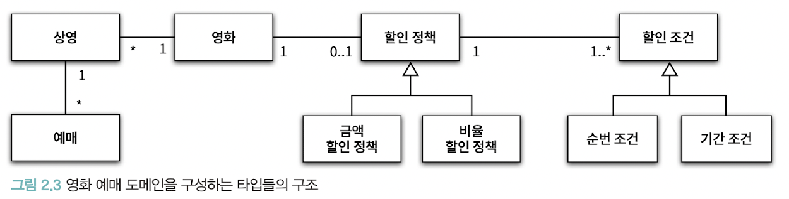
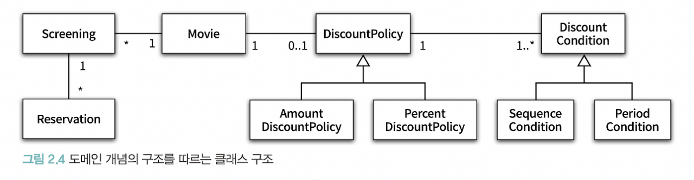
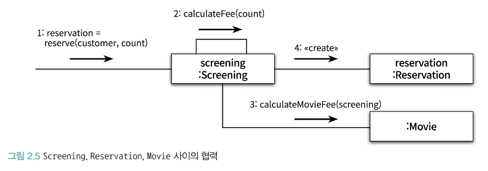
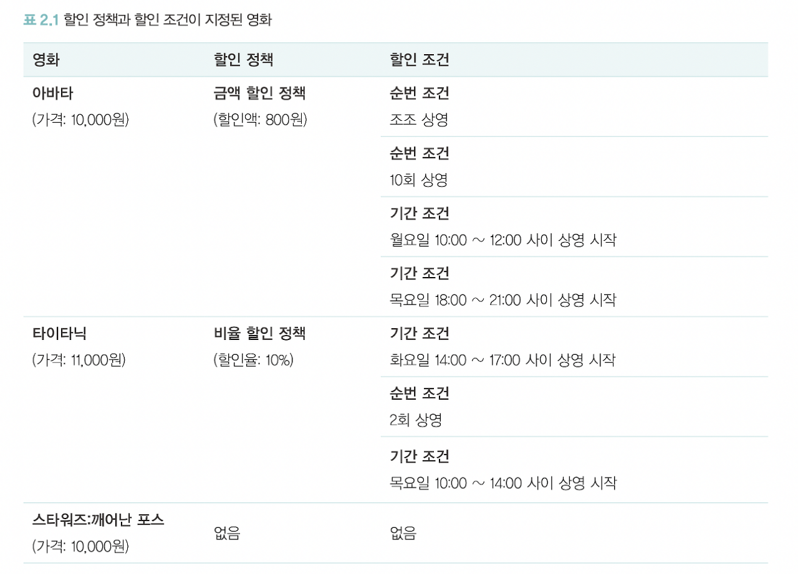
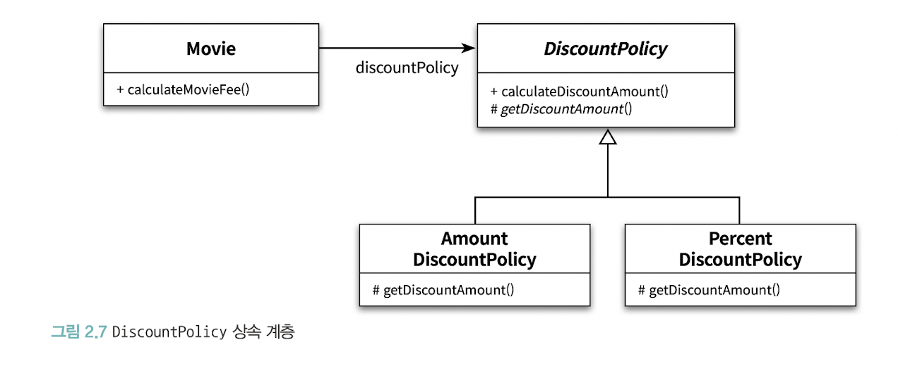

# 객체지향 프로그래밍

## 영화 예매 시스템

영화 : 영화에 대한 기본 정보(제목, 상영시간 등)

상영 : 실제로 관객들이 관람하는 사건
- 영화는 하루에 여러번 상영된다

예매라는 것은 특정 시간에 상영되는 영화를 관람할 수 있는 권리를 구매하기 위해 돈을 지불하는 것

할인액을 결정하는 두 가지 규칙
- 할인 조건
    - 순서조건: e.g. 매일 10번째 상영되는 영화를 예매하면 할인혜택
    - 기간조건: 영화 시작 시간이 기간안에 포함되면 할인
        - 요일
        - 시작시간
        - 종료시간
- 할인 정책
    - 금액 할인 정책
    - 비율 할인 정책

영화당
- 할인 정책은 최대 하나
- 할인 조건은 여러 개, 순서조건 기간조건 혼합 가능

## 객체지향 프로그래밍을 향해(v1)

### 협력, 객체, 클래스

클래스가 아닌 객체에 초점을 맞춰야 한다.

클래스는 공통적인 상태와 행동을 공유하는 객체들을 추상화 한 것.

클래스를 만들기 전에 객체의 상태와 행동을 먼저 결정해야 한다.

객체는 기능을 구현하기 위해 협력하는 공동체의 일원이다.

공통된 특성과 상태를 가진 객체들을 타입으로 분류하고, 이 타입을 기반으로 클래스를 구현해야 한다.

### 도메인의 구조를 따르는 프로그램 구조

domain: 문제를 해결하기 위해 사용자가 프로그램을 사용하는 분야

객체지향 패러다임은 요구사항 분석(초기) 단계 부터 구현(마지막) 단계까지 객체라는 추상화 기법을 사용한다. 그래서 강력하다.

요구사항과 프로그램을 객체라는 동일한 관점에서 바라볼 수 있기 때문에 도메인을 구성하는 개념들이 프로그램의 구조로 그대로 옮겨질 수 있다.





클래스의 이름은 대응되는 도메인 개념의 이름과 동일하거나 유사하게 지어야 한다.

클래스 사이의 관계도 최대한 도메인 개념 사이에 맺어진 관계와 유사하게 만들어서 프로그램의 구조를 이해하고 예상하기 쉽게 만들어야 한다.

도메인의 개념과 관계를 반영하도록 프로그램을 구조화 해야 하기 때문에 클래스 구조는 도메인의 구조와 유사한 형태를 띠어야 한다.

### 클래스 구현하기

인스턴스 변수의 가시성은 private, 메서드 가시성은 public으로 하는게 일반적이다.

클래스를 구현하거나 사용할 때 가장 중요한 것은 경계를 구분 짓는 것

어떤 부분을 외부에 공개하고 어떤 부분을 감출지 결정해야 한다.

속성에 직접 접근 하지 못 하도록 하고 메서드를 통해서 내부 상태를 변경할 수 있게 해야 한다.

경계가 명확해야 객체의 자율성과 프로그래머의 구현의 자유가 보장되기 때문이다.

#### 자율적인 객체

1. 객체는 상태(state) 와 행동(behavior)을 함께 가지는 복합적인 존재이다.
2. 객체는 스스로 판단하고 행동하는 자율적인 존재다.

객체지향은 객체라는 단위 안에 데이터와 기능을 한 덩어리로 묶는다. 이를 캡슐화라 한다.

대부분의 객체지향 언어들은 접근 제어 메커니즘을 제공한다. 접근 (public, protected, private ...).

#### 자율적인 객체

객체는 
- 상태와 행동을 함께 가지는 복합적인 존재
- 스스로 판단하고 행동하는 자율적인 존재

객체지향 언어는 캡슐화 뿐만 아니라 접근 제어 기능을 제공하기 위해 접근 수정자(access modifier)를 사용한다.
- public, protected, private

객체지향의 핵심은 스스로 상태를 관리하고, 판단하고, 행동하는 자율적인 객체들의 공동체를 구성하는 것.

외부 간섭이 최소화 되어야 객체가 자율적인 존재가 된다. 외부에서 상태와 결정에 개입하려고 하면 객체는 자율적이지 않다.

캡슐화와 접근제어는 객체를 두 부분으로 나눈다.
- 외부에서 접근 가능한 부분(public interface)
- 내부에서만 접근 가능한 부분(implementation)

인터페이스와 구현의 분리(separation of interface and implementation) 원칙은 객체지향 프로그래밍의 핵심 원리 중 하나이다.

클래스의 속성은 private으로 감추고 일부 메소드만 public으로 선언해야 한다.

서브 클래스나 내부에서 접근 하는 메소드면 protected나 private으로 선언해야 한다.

public 메소드는 퍼블링 인터페이스에 포함되고, 나머지 protected나 private 메소드는 구현에 포함된다.

#### 프로그래머의 자유

프로그래머의 역할을 클래스 작성자와 클라이언트 프로그래머로 구분하는 것이 유용하다

클래스 작성자는 새로운 데이터 타입을 프로그램에 추가하고 클라이언트 프로그래머는 클래스 작성자가 추가한 데이터 타입을 사용한다.

클라이언트 프로그래머의 목표는 필요한 클래스들을 엮어서 애플리케이션을 빠르고 안정적으로 구축하는 것이다.

클래스 작성자는 클라이언트 프로그래머에게 필요한 부분만 공개하고 나머지는 숨겨야 한다.

클라이언트 프로그래머가 숨긴 부분에 접근할 수 없도록 하면 클라이언트 프로그래머에 의한 영향을 걱정하지 않고 내부 구현을 변경할 수 있다.

이를 구현 은닉(implementation hiding)이라고 한다.

클라이언트 개발자는 구현을 알 필요 없이 인터페이스만 알고 있어도 클래스를 사용할 수 있기 때문에 필요한 지식의 양을 줄일 수 있다.

클래스 개발자는 자유롭게 내부 구현을 변경할 수 있다.

따라서 클래스를 개발할때 인터페이스와 구현을 깔끔하게 분리하기 위해 노력해야 한다.

설계가 필요한 이유는 변경을 관리하기 위해서

객체지향 언어는 객체 사이의 의존성을 관리해 변경에 대한 파급효과를 제어하는 방법을 제공한다. 가장 대표적인 것이 접근 제어

### 협력하는 객체들의 공동체

1장에서는 금액에 Long 타입을 사용했다. 하지만 이는 Money 타입처럼 저장하는 값이 금액과 관련돼있다는 의미를 전달할 수는 없다.

또한 금액과 관련된 로직이 서로 다른 곳에 중복되어 구현되는 것을 막을 수 없다.
>> 일할때 이게 꽤 중요한 부분이라 생각한다. 재사용을 위해 중복을 줄이는게 아니라 불필요하게 로직이 퍼지는걸 막다보니 재사용이 가능해지는거라고 생각하는게 앞뒤가 맞지 않나 하는 생각이다.

객체지향의 장점은 객체를 이용해 도메인의 의미를 풍부하게 표현할 수 있다는 것이다. 의미를 좀 더 명시적이고 분명하게 표현할 수 있다면 객체를 사용해야 설계의 명확성과 유연성을 높일 수 있다.



영화를 예매하기 위해 Screening, Movie, Reservation 인스턴스들은 서로의 메서드를 호출하며 상호작용 한다. 이 상호작용을 협력(collaboration)이라고 한다.

협력의 관점에서 어떤 객체가 필요한지 결정하고, 객체들의 공통상태와 행위를 구현하기 위해 클래스를 작성해야 한다.

### 협력에 대한 짧은 이야기

객체는 다른 객체의 인터페이스에 공개된 행동을 수행하도록 요청할 수 있다.

요청 받은 객체는 자율적인 방법에 따라 요청을 처리한 후 응답한다.

객체가 다른 객체와 상호작용 하는 방법은 메세지 전송이다. 요청이 도착하면 해당 객체가 메세지를 수신한 것이다.

메세지를 수신한 객체가 자율적으로 메세지를 처리하기위한 자신만의 방법을 메서드라고 한다.

메세지와 메소드를 명확하게 구분해야한다. 여기서 다형성의 개념이 출발한다.

예를들어, Screening이 Movie의 calculateFee 메소드를 호출한다고 하는 것 보다 Screening이 Movie에게 calculateFee 메세지를 전송한다고 하는 것이 더 적절한 표현이다.

Screening은 Movie 안에 calculateFee 메소드가 존재하고 있는지도 알지 못한다. 응답할 수 있다고 믿고 메세지를 전송하는 것이다.

메세지를 수신받은 Movie는 적절한 메서드를 선택한다. 방법을 선택하는 것은 Movie 스스로의 문제다. 메세지를 처리하는 방법을 자율적으로 결정할 수 있는 이유다.
> 동적 타입 언어에서는 다른 시그니처를 가진 메소드를 이용해 해당 메세지에 응답할 수 있다고 한다.

## 할인 요금 구하기(v2)

> 여기부턴 클래스 설계가 아닌 구현 영역?

### 할인 요금 계산을 위한 협력 시작하기

### 할인 정책과 할인 조건

### 할인 정책 구성하기

```kotlin
val avatar = Movie(
    "아바타",
    Duration.ofMinutes(120),
    Money.wons(10000),
    AmountDiscountPolicy(
        Money.wons(800),
        SequenceCondition(1),
        SequenceCondition(10),
        PeriodCondition(
            DayOfWeek.MONDAY,
            LocalTime.of(10, 0),
            LocalTime.of(11, 59)
        ),
        PeriodCondition(
            DayOfWeek.TUESDAY,
            LocalTime.of(10, 0),
            LocalTime.of(20, 59)
        )
    )
)
```

```kotlin
val titanic = Movie(
    "타이타닉",
    Duration.ofMinutes(180),
    Money.wons(11000),
    PercentDiscountPolicy(
        0.1,
        PeriodCondition(
            DayOfWeek.TUESDAY,
            LocalTime.of(14, 0),
            LocalTime.of(16, 59)
        ),
        SequenceCondition(2),
        PeriodCondition(
            DayOfWeek.THURSDAY,
            LocalTime.of(10, 0),
            LocalTime.of(13, 59)
        )
    )
)
```

생성자에 필요한 정보를 전달하도록 강제하면 올바른 상태를 가진 객체 생성을 보장할 수 있다.



## 상속과 다형성

Movie 클래스에는 할인 정책이 어떤 것인지 판단하는 조건문이 없음에도 할인 정책을 선택해 넣을 수 있다. 이는 상속과 다형성 때문이다.

### 컴파일 시간 의존성과 실행 시간 의존성



어떤 클래스가 다른 클래스에 접근할 수 있는 경로를 가지거나 해당 클래스의 객체의 메서드를 호출할 수 있는 경우 두 클래스 사이에 의존성이 존재한다고 한다.

Movie는 DiscountPolicy와 연결돼있지만, 영화 요금 계산을 위해서는 PercentDiscountPolicy 혹은 AmountDiscountPolicy의 인스턴스가 필요하다.


실제로 실행 시 Movie는 PercentDiscountPolicy 혹은 AmountDiscountPolicy의 인스턴스에 의존하지만, 코드 수준에서는 DiscountPolicy에만 의존한다.

코드 의존성과 실행 시점의 의존성은 서로 다를 수 있다. 즉, 클래스 사이의 의존성과 객체 사이의 의존성은 다를 수 있다.

코드 의존성과 실행 시점 의존성이 다른 것은 유연하고 쉽게 재사용할 수 있으며 확장 가능한 객체지향 설계가 가지는 특징이다.

대신 이렇게하면 코드를 이해하기 어려워진다. 객체 생성과 연결 부분을 찾아야 하기 때문이다. 대신 코드는 유연해지고 확장 가능해진다. => 트레이드 오프

예를 들어 Movie의 인스턴스가 어떤 객체에 의존하고 있는지 알기 위해서 Movie 클래스의 코드만 살펴봐서는 알 수 없다. 어디서 의존성을 주입하고 있는지 찾아야 알 수 있다.

설계가 유연해지수록 코드를 이해하고 디버깅하기는 점점 어려워진다.

반대로 유연성을 억제하면 코드를 이해하고 디버깅 하기는 쉬워지지만 재사용성과 화장 가능성은 낮아진다.

유연성과 가독성 사이에서 고민해야 한다. 둘 다 항상 정답이 아니다.

### 차이에 의한 프로그래밍

클래스를 추가하고 싶은데, 그 클래스가 기존의 어떤 클래스와 매우 흡사할 경우 상속을 이용하면 그 클래스의 코드를 수정하지 않고 재사용할 수 있다. 그 클래스를 기반으로 새로운 클래스를 쉽고 빠르게 추가할 수 있다.

상속을 이용하면 부모 클래스의 구현은 공유하면서 행동이 다른 자식 클래스를 쉽게 추가할 수 있다.

이런 방식을 차이에 의한 프로그래밍(programming by difference)이라고 한다.

### 상속과 인터페이스

상속은 메서드나 인스턴스 변수를 재사용한다는 점 보다 부모 클래스가 제공하는 모든 인터페이스를 자식 인터페이스가 물려받을 수 있다는 점이 중요하다.

외부 객체는 자식 클래스를 부모 클래스와 동일한 타입으로 간주할 수 있는데, 인터페이스가 같으므로 부모 클래스가 수신할 수 있는 메세지는 자식 클래스도 수신받을 수 있기 때문이다.

메세지를 보내는 입장에서 메세지를 보낼 객체의 인스턴스가 어떤건지는 중요하지 않다. 메세지를 수신할 수 있는지 여부만 중요하다. 그러면 해당 객체와 협력 할 수 있다.

자식 클래스가 부모 클래스를 대신하는 것을 업캐스팅이라고 부른다.
>> `List<String> list = new ArrayList<>();` 가장 먼저 떠오른 예시

### 다형성

메세지와 메소드는 다른 개념이다. 실행되는 메서드는 객체의 클래스가 뭔지에 따라 달라진다. 예를 들어, PercentDiscountPolicy의 인스턴스가 연결되면 PercentDiscountPolicy가 오버라이딩한 calculateDiscountAmount 메서드가 실행된다.

이처럼 어떤 메서드가 실행될 것인지는 메세지를 수신하는 객체의 클래스가 무엇이냐에 따라 달라진다. 이를 다형성이라고 한다.

다형성은 컴파일 시간 의존성과 실행 시간 의존성이 다를 수 있다는 사실을 기반으로 한다.

다형성은 동일한 메세지를 수신했을 때 객체의 타입에 따라 다르게 응답할 수 있는 능력을 의미한다. 

이를 위해 다형적 협력에 참여하는 객체들은 같은 메세지를 이해할 수 있어야 한다. 이를 위해 인터페이스를 통일하는 것이 상속이다. 

다형성을 구현하는 방법은 메세지와 메서드를 실행 시점에 바인딩 하는 것이다. 이를 지연 바인딩 혹은 동적 바인딩이라고 한다.

반대로 컴파일 시점에 실행될 함수나 프로시저를 결정하는 것을 초기 바인딩 또는 정적 바인딩이라고 한다.

상속을 이용하면 동일한 인터페이스를 공유하는 클래스들을 같은 타입 계층으로 묶을 수 있다.

따라서 다형성과 상속을 묶어서 얘기하는게 대부분이지만, 이외에도 다형성을 구현할 수 있는 방법이 있다.

> 상속에는 구현 상속과 인터페이스 상속이 있다.
> 구현 상속을 서브 클래싱이라고 부르고 인터페이스 상속을 서브 타이핑이라고 부른다.
> 
> 재사용 목적을 구현 상속ㅇ라 하고,, 인터페이스 공유를 위한 상속을 인터페이스 상속이라고 한다.
> 
> 구현 상속이 아닌 인터페이스 상속을 사용해야 한다. 상속의 주 목적은 코드 재사용이 아니다. 재사용을 목적으로 상속을 사용하면 변경에 취약한 코드를 만들 가능성이 높아진다.

### 인터페이스와 다형성

구현 공유 없이 인터페이스만 공유하고 싶을 경우 자바에서는 인터페이스 라는 문법을 제공한다.

