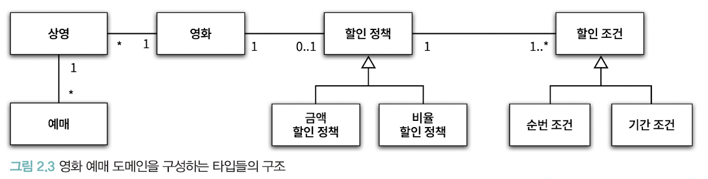
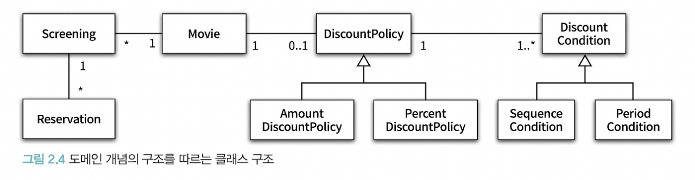

# 객체지향 프로그래밍

## 영화 예매 시스템

영화 : 영화에 대한 기본 정보(제목, 상영시간 등)

상영 : 실제로 관객들이 관람하는 사건
- 영화는 하루에 여러번 상영된다

예매라는 것은 특정 시간에 상영되는 영화를 관람할 수 있는 권리를 구매하기 위해 돈을 지불하는 것

할인액을 결정하는 두 가지 규칙
- 할인 조건
  - 순서조건: e.g. 매일 10번째 상영되는 영화를 예매하면 할인혜택
  - 기간조건: 영화 시작 시간이 기간안에 포함되면 할인
    - 요일
    - 시작시간
    - 종료시간
- 할인 정책
  - 금액 할인 정책
  - 비율 할인 정책

영화당
- 할인 정책은 최대 하나
- 할인 조건은 여러 개, 순서조건 기간조건 혼합 가능

## 객체지향 프로그래밍을 향해

### 협력, 객체, 클래스

클래스가 아닌 객체에 초점을 맞춰야 한다.

클래스는 공통적인 상태와 행동을 공유하는 객체들을 추상화 한 것.

클래스를 만들기 전에 객체의 상태와 행동을 먼저 결정해야 한다.

객체는 기능을 구현하기 위해 협력하는 공동체의 일원이다.

공통된 특성과 상태를 가진 객체들을 타입으로 분류하고, 이 타입을 기반으로 클래스를 구현해야 한다.

### 도메인의 구조를 따르는 프로그램 구조

domain: 문제를 해결하기 위해 사용자가 프로그램을 사용하는 분야

객체지향 패러다임은 요구사항 분석(초기) 단계 부터 구현(마지막) 단계까지 객체라는 추상화 기법을 사용한다. 그래서 강력하다.

요구사항과 프로그램을 객체라는 동일한 관점에서 바라볼 수 있기 때문에 도메인을 구성하는 개념들이 프로그램의 구조로 그대로 옮겨질 수 있다.

클래스의 이름은 대응되는 도메인 개념의 이름과 동일하거나 유사하게 지어야 한다.

클래스 사이의 관계도 최대한 도메인 개념 사이에 맺어진 관계와 유사하게 만들어서 프로그램의 구조를 이해하고 예상하기 쉽게 만들어야 한다.

도메인의 개념과 관계를 반영하도록 프로그램을 구조화 해야 하기 때문에 클래스 구조는 도메인의 구조와 유사한 형태를 띠어야 한다.

### 클래스 구현하기

인스턴스 변수의 가시성은 private, 메서드 가시성은 public으로 하는게 일반적이다.

클래스를 구현하거나 사용할 때 가장 중요한 것은 경계를 구분 짓는 것

어떤 부분을 외부에 공개하고 어떤 부분을 감출지 결정해야 한다.

속성에 직접 접근 하지 못 하도록 하고 메서드를 통해서 내부 상태를 변경할 수 있게 해야 한다.

경계가 명확해야 객체의 자율성과 프로그래머의 구현의 자유가 보장되기 때문이다.

#### 자율적인 객체

1. 객체는 상태(state) 와 행동(behavior)을 함께 가지는 복합적인 존재이다.
2. 객체는 스스로 판단하고 행동하는 자율적인 존재다.

객체지향은 객체라는 단위 안에 데이터와 기능을 한 덩어리로 묶는다. 이를 캡슐화라 한다.

대부분의 객체지향 언어들은 접근 제어 메커니즘을 제공한다. 접근 (public, protected, private ...).
