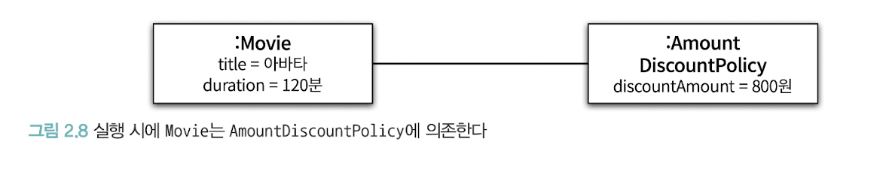

# ch02. 객체지향 프로그래밍

객체지향 프로그래밍?
- 현실세계와 비슷한 모델링을 해서 이해하기 쉽게 한다.
- 변경하기 쉽게 만들어 유연하게 만든다.

유연한 구조는 복잡하다. 그러면 이해하기 힘들어질 수 있다. 그래서 그 사이 트레이드오프를 잘 생각해야 한다.

## 이해하기 쉽게 하려면?

### 도메인의 구조를 따르는 프로그램 구조

설계를 할때 각 요구사항을 객체로 추상화 시켜 표현하면 도메인을 구성하는 개념들을 프로그램의 구조로 그대로 옮겨올 수 있다.

클래스 이름은 도메인 개념의 이름과 동일하거나 유사하도록, 클래스 사이의 관계도 유사하게 만들면 프로그램 구조를 이해하고 예상하기 쉬워진다.

### 객체는?
1. 객체는 상태(state) 와 행동(behavior)을 함께 가지는 복합적인 존재이다.
2. 객체는 스스로 판단하고 행동하는 자율적인 존재다.

클래스가 아닌 객체에 초점을 맞춰야 한다.

클래스는 공통적인 상태와 행동을 공유하는 객체들을 추상화 한 것.

클래스를 만들기 전에 객체의 상태와 행동을 먼저 결정해야 한다.

인스턴스들은 서로의 메서드를 호출하며 상호작용 한다. 이 상호작용을 협력(collaboration)이라고 한다.

객체는 기능을 구현하기 위해 협력하는 공동체의 일원이다.

공통된 특성과 상태를 가진 객체들을 타입으로 분류하고, 이 타입을 기반으로 클래스를 구현해야 한다.

### 자율적이려면?

외부 간섭이 최소화 되어야 객체가 자율적인 존재가 된다. 외부에서 상태와 결정에 개입하려고 하면 객체는 자율적이지 않다.

그래서 캡슐화와 접근제어를 사용해서 객체를 두 부분으로 나눈다. 인터페이스와 구현의 분리(separation of interface and implementation) 원칙

- 외부에서 접근 가능한 부분(public interface)
- 내부에서만 접근 가능한 부분(implementation)
> public 메소드는 public 인터페이스에 포함되고 나머지 protected나 private 메소드는 구현에 포함된다.

### 좋아지는 점?

클래스 작성자는 타입을 추가하는 개발자. 클라이언트 프로그래머는 그걸 사용하는 개발자.

클래스 작성자는 필요한 부분만 노출시킨다.

그러면 클라이언트 프로그래머가 받는 파급 효과를 제어할 수 있다.

클라이언트 프로그래머는 해당 인터페이스만 알면 되니 빠르고 안정적이게 시스템 구축 가능

셜계가 필요한 이유는 변경 관리를 위해서?

### 타입을 직접 만들어쓴다?

금액을 표현하는 타입으로 Money를 만들어 사용하면 저장하는 값이 금액과 관련되어있다는 의미를 전달할 수 있다.

또한 금액과 관련된 로직이 서로 다른 곳에 중복 구현 되는 것을 막을 수 있다.

객체를 이용해 도메인의 의미를 풍부하게 표현할 수 있다는게 객체지향의 장점. 

의미를 명시적이고 분명하게 표현하면 설계의 명확성과 유연성을 높일 수 있다.

## 유연하게 하려면?

### 협력에 대한 짧은 이야기(다형성 설명?)

객체가 다른 객체와 상호작용 하는 방법은 메세지 전송. 요청이 도착하면 해당 객체가 메세지를 수신한 것.

메세지를 수신한 객체가 자율적으로 메세지를 처리하기 위한 방법이 메서드

메세지는 인터페이스고 메소드는 구현. 메세지와 메소드를 명확하게 구분해야한다.

인터페이스를 하나 두고 구현이 여러개 나올 수 있도록 하는 것이 다형성. 메세지 보내는 쪽은 구현이 어떤건지 모른다. (그렇다고 의존하지 않는 것은 아니다.)

이런 식의 구현을 하려면 의존성이 역전된다. 컴파일 타임에 호출하는 쪽은 인터페이스에 의존하고 구현도 인터페이스에 의존한다.

하지만 런타임에는 각 구현 인스턴스에 의존하게 된다.

이러면 의존성 관리하는 코드에서 구현의 내부를 바꾸거나 종류를 바꿔도 호출하는 쪽은 그대로 사용할 수 있다. 

코드레벨에서는 인터페이스에만 의존하기 때문에 제어문이 없어도 되니까 유연하다.

대신 이러면 코드 이해가 어려워진다. 코드만 봐서는 어디서 의존하는지 알기 힘들기 때문에. 디버깅도 어려워진다.

반대로 유연성을 억제하면 코드를 이해하고 디버깅 하기는 쉬워지지만 재사용성과 확장 가능성은 낮아진다.

유연성과 가독성 사이에서 고민해야 한다. 트레이드오프

## 상속

- 구현 상속: 서브클래싱, 재사용 목적
- 인터페이스 상속: 서브 타이핑, 인터페이스 공유를 위한 것
> 재사용을 목적으로 상속을 사용하면 변경에 취약한 코드를 만들 가능성이 높아진다.

### 구현 상속

#### 차이에 의한 프로그래밍

차이에 의한 프로그래밍(programming by difference)의 상속을 이용해 구현은 공유하면서 행동이 다른 자식 클래스를 만드는 것.

추가할 클래스가 기존 클래스와 매우 흡사할 경우 기존 클래스를 기반으로 쉽고 빠르게 추가할 수 있다.

#### 합성

재사용이 목적이면 상속보다 합성(composition)이 더 좋은 방법이다.

상속은 캡슐화를 위반하고 설계를 유연하지 못하게 한다는 점에서 설계에 좋지 않은 영향을 미치기 때문이다.
> 부모 클래스의 구현이 자식에게 노출된다. 자식과 부모가 강결합 된다. 부모 클래스의 변경이 자식 클래스에 영향을 미친다. 변경이 어려워진다.

그리고 부모 클래스와 자식 사이 관계가 컴파일 시점에 결정돼서 런타임에 객체 종류를 변경하는게 불가능해진다.

합성은 다른 객체의 인스턴스를 자신의 인스턴스 변수로 포함하여 재사용하는 방법이다.

그러면 인터페이스에 정의된 메세지를 통해서만 재사용이 가능해잔다.
> `super.myMethod`() 와 같은 식으로 호출하는 것이 아닌 `otherObject.myMethod()` 와 같이 호출하는 것이다.

이러면 부모의 구현이 캡슐화되고 부모의 변경에 영향을 덜 받는다. 느슨하게 결합되어 설계가 유연해진다.

또한 의존하는 인스터스를 변경하는게 비교적 쉽기 때문에 설계를 유연하게만든다.

상속은 클래스를 통해 강하게 결합되는데, 합성은 느슨하게 결합된다.

상속을 아예 사용하지 말라는 것은 아니다. 다형성을 이용해야할때는 상속을 사용해야 한다.

### 인터페이스 상속

상속은 변수를 재사용하는 것 보다 인터페이스를 물려받는다는 점이 더 중요하다.

외부는 자식과 부모를 동일한 타입으로 간주할 수 있는데(업캐스팅), 부모가 수신할 수 있는 메세지는 자식도 수신할 수 있기 때문이다.

상속은 결국 다형적 협력에 참여하는 객체들이 같은 메세지를 이해할 수 있도록 인터페이스를 통일하는 것이다.

이러면 동일한 인터페이스를 공유하는 클래스들을 같은 타입으로 묶을 수 있다.

구현 공유 없이 인터페이스만 공유하고 싶을 경우 자바에서는 인터페이스 라는 문법을 제공한다.

#### 다형성

다형성은 컴파일 시간 의존성과 실행 시간 의존성이 다를 수 있다는 사실을 기반으로 한다.

다형성은 동일한 메세지를 수신했을 때 객체의 타입에 따라 다르게 응답할 수 있는 능력을 의미한다.

다형적 협력에 참여하는 객체들은 같은 메세지를 이해할 수 있어야 한다. 이를 위해 인터페이스를 통일하는 것이 인터페이스 상속이다.

다형성을 구현하는 방법은 메세지와 메서드를 실행 시점에 바인딩 하는 것이다. 이를 지연 바인딩 혹은 동적 바인딩이라고 한다.

따라서 다형성과 상속을 묶어서 얘기하는게 대부분이지만, 이외에도 다형성을 구현할 수 있는 방법이 있다.

---

## 영화 예매 시스템

영화 : 영화에 대한 기본 정보(제목, 상영시간 등)

상영 : 실제로 관객들이 관람하는 사건
- 영화는 하루에 여러번 상영된다

예매라는 것은 특정 시간에 상영되는 영화를 관람할 수 있는 권리를 구매하기 위해 돈을 지불하는 것

할인액을 결정하는 두 가지 규칙
- 할인 조건
    - 순서조건: e.g. 매일 10번째 상영되는 영화를 예매하면 할인혜택
    - 기간조건: 영화 시작 시간이 기간안에 포함되면 할인
        - 요일
        - 시작시간
        - 종료시간
- 할인 정책
    - 금액 할인 정책
    - 비율 할인 정책

영화당
- 할인 정책은 최대 하나
- 할인 조건은 여러 개, 순서조건 기간조건 혼합 가능

### 할인 정책 구성하기

## 추상화와 유연성

### 추상화의 힘

할인 정책은 금액 할인 정책과 비율 할인 정책을 포괄하는 추상적인 개념. 할인 조건 역시 마찬가지(순번 조건, 기간 조건)

언어 측면에서 보면 DiscountPolicy와 DiscountCondition은 인터페이스. 더 추상적.

모든 할인 정책 및 할인 조건들이 수신할 수 있는 메시지를 정의하기 때문. 자식 클래스가 구현을 결정할 수 있도록 결정권을 위임한다.

> 자식 클래스를 생략한 코드 구조를 그림으로 표현한 것. 

- 추상화의 계층만 살펴보면 요구사항의 정책을 높은 수준에서 서술할 수 있다.
  - 그림 2.13을 글로 서술하면, `영화 예매 요금은 최대 하나의 할인 정책과 다수의 할인 조건을 이용해 계산할 수 있다.` 로 표현할 수 있다. 
    > 위 문장은 영화 요금은 금액 할인 정책과 두 개의 순서 조건, 한 개의 기간 조건을 이용해서 계산할 수 있다라는 문장을 포괄할 수 있다. 할인 정책과 할인 조건이라는 추상적인 개념을 사용해 문장을 작성했기 때문
  - 추상화를 사용하면 세부적인 내용 없이 상위 정책을 표현할 수 있다. 상위 개념만으로도 도메인의 중요한 개념을 설명할 수 있다.
  - 추상화를 이용해 상위 정책을 기술하는 것은 애플리케이션의 협력 흐름을 기술하는 것. 
  - 할인 정책이나 할인 조건의 자식 클래스들은 추상화를 이용해서 정의한 상위의 협력 흐름을 그대로 따르게 된다.
    > 재사용 가능한 설계의 기본을 다루는 디자인 패턴이나 프레임워크 모두 추상화를 이용해 상위 정책을 정의하는 객체지향 매커니즘을 사용한다.
- 추상화를 이용하면 설계가 유연해진다.
  - 추상화를 이용하면 기존 구조를 변경하지 않고 새로운 기능을 추가하고 확장할 수 있다.

### 유연한 설계(v3, v4)

추상화가 유연한 설계를 가능하게 하는 이유는 설계가 구체적인 상황에 결합되는 것을 방지하기 때문이다.

Movie는 특정한 할인 정책에 묶이지 않는다. DiscountPolicy 역시 특정한 할인 조건에 묶여있지 않다.

이를 컨텍스트 독립성(context independence)이라고 한다. 프레임워크와 같은 유연한 설계가 필수적인 분야에서 그 진가를 발휘한다.

### 추상 클래스와 인터페이스 트레이드오프(v5)

v3의 Movie를 보면, `NoneDiscountPolicy` 클래스의 getDiscountAmount() 메소드가 어떤 값을 반환하더라도 상관 없다.

부모 클래스인 DiscountPolicy에서 할인 조건이 없을 경우 getDiscountAmount() 메소드를 호출하지 않기 때문이다.

이는 부모클래스와 자식클래스를 개념적으로 결합 시킨다.

개발자는 getDiscountAmount()가 호출되지 않으면 DiscountPolicy가 0원을 반환할 것이라는 사실을 알고 있다.

이를 해결하려면 DiscountPolicy를 인터페이스로 바꾸고 getDiscountAmout 메소드가 아닌 calculateDiscountAmount 오퍼레이션을 오버라이딩하도록 바꾸면 된다.

이상적으로는 인터페이스를 사용하도록 변경한 설계가 더 좋지만, 현실적으로 과하다 생각이 들 수도 있다.

변경 전의 NoneDiscountPolicy 클래스 역시 할인 금액이 0원이라는 사실을 효과적으로 전달하기 때문
> 책에서도 v4를 기준으로 설명할거라 말한다.

구현과 관련된 모든 것들은 트레이드 오프의 대상이 될 수 있다.

작성하는 코드에는 합당한 이유가 있어야 한다. 아주 사소한 결정이라도 고민하고 트레이드 오프 해야한다.

### 코드 재사용

재사용이 목적이면 상속보다 합성(composition)이 더 좋은 방법이다. 
> 합성은 다른 객체의 인스턴스를 자신의 인스턴스 변수로 포함해서 재사용하는 방법이다.

Movie가 DiscountPolicy의 코드를 재사용하는 방법이 합성이다.
> 이걸 상속으로 변경할 수도 있다. DiscountPolicy의 메소드를 Movie로 옮기고 이를 상속받는 AmoudDiscountMovie, PercentDiscountMovie를 만들면 된다.

### 상속(v6)

상속은 캡슐화를 위반 하는 것과 설계를 유연하지 못하게 한다는 점에서 설계에 안 좋은 영향을 미친다.

상속을 이용하기 위해서는 부모 클래스의 내부 구조를 알고 있어야 한다. 부모 클래스의 구현이 자식 클래스에게 노출된다.

이러면 캡슐화가 약해지고 자식 클래스가 부모 클래스에 강하게 결합되기 떄문에 부모 클래스를 변경할때 자식 클래스도 같이 바뀌어야 할 확률을 높인다.

즉 변경이 어려워진다.

상속은 부모 클래스와 자식 클래스 사이의 관계를 컴파일 시점에 결정한다. 따라서 실행 시점에 객체의 종류를 변경하는 것이 불가능해진다.

---

객체지향은 객체를 지향하는 것. 협력에 참여하는 객체들 사이의 상호작용이 중요하다.

객체지향 설계의 핵심은 적절한 협력을 식별하고, 협력에 필요한 역할을 정의한 후에 수행할 수 있는 적절한 객체에게 적절한 책임을 할당하는 것.

