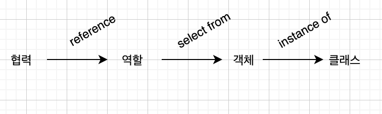

# ch03. 역할 책임 협력

> 모듈의 목적 - 변경하기 쉬우면서 이해하기도 쉬워야 한다. 이 사이의 트레이드 오프

객체지향 패러다임의 관점에서 핵심은
- 역할(role)
- 책임(responsibility)
- 협력(collaboration)

클래스, 상속, 지연 바인딩 같은건 구현 측면. 패러다임의 본질과는 거리가 있다.

> 2장 코드를 기반으로 설명한다.

## 01. 협력

객체지향 애플리케이션의 제어 흐름은 하나의 객체에 의해 통제되지 않고 분배된다. 객체들은 하나의 기능을 구현하기 위해 메세지를 주고받으며 상호작용 한다. 

이 상호작용이 협력이다. 협력에 참여하기 위해 수행하는 로직이 책임이다. 협력 안에서 수행하는 책임들이 모여 역할을 구성한다.

### 협력

메세지 전송은 협력을 위한 커뮤니케이션 수단.

메세지를 수신한 객체는 메서드를 실행해 요청에 응답

자율적으로 만들기 위해 캡슐화

Screening은 Movie에 calculateMovieFee 메세지를 보내 예매자의 요금 계산을 요청한다. Movie가 요금 계산에 필요한 기본 요금과 할인 정책을 가장 잘 알고 있기 때문이다.

Screening이 직접 계산하려면 Movie의 내부 구현을 알아야 한다. 이러면 자율성이 훼손된다.

### 협력이 설계를 위한 문맥을 결정한다

애플리케이션 안에 객체가 필요한 이유는 해당 객체가 협력에 참여하고 있기 때문이다. 협력에 참여하려면 적절한 행동을 보유해야 한다.

행동을 결정하는 것은 객체가 참여하고 있는 협력이다. 협력이 바뀌면 행동 역시 바뀌어야 한다.

Movie 라는 클래스가 있다면 대부분은 play라는 행동을 할거라 생각하겠지만, 실제로는 상영이 아닌 요금 계산과 관련된 행동을 한다. 영화 상영이 아닌 예매를 위한 협력이기 때문이다.

객체의 상태를 결정하는 것은 행동. 자신의 상태를 스스로 결정하고 관리해야 한다.

상태는 행동하는데 필요한 정보에 의해 결졍된다.

행동은 협력 안에서 객체가 처리할 메세지로 결정된다.

즉 협력은 행동과 상태를 결정한다. 따라서 협력은 객체 설계에 필욯나 일종의 문맥(context)을 제공한다.

## 02. 책임

책임은 협력에 참여하기 위해 객체가 수행하는 행동이다.

책임이란 객체에 의해 정의되는 응집도 있는 행위의 집합. 객체가 유지해야 하는 정보와 수행할 수 있는 행동에 대해 서술한 문장.

객체의 책임은 하는 것과 아는 것의 범주로 나눌 수 있다.

- 하는 것(doing)
  - 스스로 하는 것(객체 생성, 계산 수행 등)
  - 다른 객체의 행동을 시작시키는 것
  - 다른 객체의 활동을 제어하고 조절하는 것
- 아는 것(knowing)
  - 사적인 정보에 관해 아는 것
  - 관련된 객체에 대해 아는 것
  - 자신이 유도하거나 계산할 수 있는 것에 관해 아는 것

Screening 의 책임은 영화를 예매하는 것. 이것은 하는 것. 상영할 영화를 알아야한다. 이거는 아는ㄴ 것. 

Movie 의 책임은 요금을 계산하는 것(하는 것). 가격과 할인정책을 알아야 한다(아는 것).

책임은 객체가 수행할 수 있는 행동을 종합적이고 간략하게 서술하기 때문에 메세지보다 추상적이고 개념적으로도 더 크다.

책임의 관점에서 아는 것과 하는 것이 밀접하게 연관돼있다.

책임이 가장 중요하기 때문에 책임을 먼저 정하고 구현은 나주엥 생각하는게 좋다.

### 책임 할당

책임 할당을 위한 정보 전문가(Information Expert) 패턴

기능을 하나의 책임으로 바라본 뒤 이를 완료하는데 필요한 더 작은 책임을 찾아내고 이를 객체들에게 할당하는 과정을 반복한다.

영화 시스템을 예로 들면

1. 협력을 위한 메세지 선택(예매하라)
2. 처리할 객체는 예매에 필요한 정보를 가장 잘알고 있는 정보 전문가(정보를 소유하거나 정보 소유자를 잘 알고 있는 전문가)  Screening
3. Screening이 처리할 수 없는 부분을 위한 메세지 선택(가격을 계산하라)
4. 가격을 계산하는데 필요한 정보를 가장 잘 알고 있는 정보 전문가 Movie
5. Movie도 할인 요금같은건 알지 못하니 할인 요금을 계산하라는 새로운 메세지 식별

객체지향 설계는 위와 같은 과정 반복(협력에 필요한 메세지를 찾고 메세지에 적절한 객체를 선택)

메세지는 수신할 객체의 책임을 결정하고, 퍼블릭 인터페이스가 된다.

응집도와 결합도의 관점에서 정보 전문가가 아닌 다른 객체에게 책임을 할당하는 것이 더 적절한 경우도 있다. 

하지만 기본 전략은 정보 전문가에게 할당한다. 이러면 상태와 행동을 함께 가지는 자율적인 객체를 만들 가능성이 높아진다.

### 책임 주도 설계

RDD(Responsibility-Driven Design) 

위에서 제시한건 RDD에서 제시하는 기본적인 흐름을 따른 것

1. 시스템 책임을 파악한다(시스템이 사용자에게 제공해야 하는 기능)
2. 시스템 책임을 더 작은 책임으로 분할한다.
3. 분할된 책임을 수행할 수 있는 적절한 객체 또는 역할을 찾아 책임을 할당한다.
4. 객체가 책임을 수행하는 도중 다른 객체의 도움이 필요한 경우 이를 책임질 적절한 객체 또는 역할을 찾는다.
5. 해당 객체 또는 역할에게 책임을 할당함으로써 두 객체가 협력하게 한다.

책임에 집중하는 것이 중요한 이유는 유연하고 견고한 객체지향 시스템을 위한 가장 중요한 재료가 책임이기 때문 

메세지가 객체를 결정하고 행동이 상태를 결정한다.

### 메세지가 객체를 결정한다

책임을 할당할때 메세지를 먼저 식별하고 객체를 나중에 선택했다. 메세지가 객치를 선택한다.

이유는?

- 객체가 최소한의 인터페이스를 가질 수 있게 된다.
- 객체는 충분히 추상적인 인터페이스를 가질 수 있게 된다.
  - 인터페이스는 무엇을 하는지 표현해야 하지만 어떻게 수행하는지를 노출해서는 안 된다.

### 행동이 상태를 결정한다

객체의 행동은 객체가 협력에 참여할 수 있는 유일한 방법.

객체에 어떤 상태가 필요한지 먼저 정의하면 캡슐화를 저해한다. 이를 데이터 주도 설계라고 부르기도 한다.

상태는 객체가 행동을 정상적으로 수행하기 위한 재료일 뿐이다.

## 03. 역할

### 역할과 협력

역할은 객체가 특정한 협력 안에서 수행하는 책임의 집합

객체가 아닌 역할에게 책임을 할당한다. 그 다음 역할을 수행할 객체를 선택한다.

(Screening이나 Moive라는 객체를 선택할때도 익명의 역할을 찾고 그 역할을 수행할 객체를 선택한 것이다)

### 유연하고 재사용 가능한 협력

역할을 고려하지 않는다면?

영화 예매 도메인에는 두 가지 할인 정책이 존재하니 AmountDiscountPolicy, PercentDiscountPolicy 의 두 가지 객체 인스턴스가 요금을 계산하라 메세지에 응답할 수 있어야 한다.

하지만 두 종류의 객체가 참여하는 협력은 개별적이지 않다. 

DiscountPolicy라는 동등한 책임을 수행한다. 할인 요금을 계산하라는 메세지에 응답할 수 있는 대표자이다. 

대표자의 자리에 두 종류의 객체가 교대로 들어올 수 있다. 이게 슬롯이 바로 역할이다.

여기서 역할은 두 종류의 구체적인 객체를 포괄하는 추상화다. 역할의 구현은 추상 클래스와 인터페이스다.

### 객체 대 역할

한 종류의 객체만 협력에 참여한다면 역할의 개념이 유용할까?

협력에 참여하는 후보가 여러 종류의 객체에 의해 수행된다면 그 후보는 역할이 된다.

하지만 단 한 종류의 객체만이 협력에 참여한다면 그 후보는 객체가 된다.

특정 객체가 하나의 역할을 항상 수행한다면 그 둘은 같은 것이다.

여러 객체가 동일한 책임을 수행할 수 있다면 혁할은 책임의 집합이 된다.

설계 초기에는 이런게 애매할 수 있는데, 일단 객체로 생각하고 동일한 책임을 다른 방식으로 수행하는 객체들이 필요해지면 역할 개념을 도입해도 된다.

여러가지 시나리오를 설계로 옮기면서 협력을 정제하다보면 두 협력이 거의 유사한 구조를 보이는 때가 있다.

이때 두 협력을 하나로 합치면서 포괄할 수 있는 역할로 객체를 대체할 수 있다.

### 역할과 추상화

추상화를 이용한 설계가 가질 수 있는 두 가지 장점
1. 중요한 정책을 상위 수준에서 단순화할 수 있다
2. 설계가 유연해진다.

역할은 공통의 책임을 바탕으로 객체의 종류를 숨긴다. 따라서 객체는 역할의 추상화로 볼 수 있다.
> DiscountPolicy, DiscountCondition 의 구현은 숨기고 협력하는 객체들은 인터페이스(역할)만 아니까

따라서 협력도 추상화의 장점을 가진다. 

협력 안에서 역할이라는 추상화를 이용하면 기존 코드를 수정하지 않고도 새로운 행동들을 추가할 수 있다.

따라서 유연한 설계를 얻을 수 있다.

프레임워크나 디자인 패턴과 같이 재사용 가능한 코드나 설계 아이디어를 구성하는 핵심적인 요소가 바로 역할이다.

### 배우와 배역

연극에 참여하는 순간 배우는 사라지고 배역만 남는다. 무대의 막이 내리면 배역은 사라지고 배우로 돌아온다.

- 배역은 연극 배우가 특정 연극에서 연기하는 역할이다.
- 배역은 연극이 상영되는 동안에만 존재하는 일시적인 개념이다.
- 연극이 끝나면 연극 배우는 배역이라는 역할을 벗어 버리고 원래의 연극 배우로 돌아온다.

동일한 배역을 여러명의 배우들이 연기할 수 있다.

또한 동일한 배우가 여러 배역을 연기할 수 있다.

위의 은유는 협력 안에서 역할을 수행하는 객체라는 관점이 가진 입체적인 측면들을 담아낸다.

객체는 협력이라는 실행 컨텍스트 안에서 특정한 역할을 수행한다.

객체는 협력이 끝나면 협력에서의 역할을 잊고 원래의 객체로 돌아올 수 있다.

역할은 특정 협력에 참여해서 책임을 수행하는 객체의 일부다.

역할은 객체가 협력에 참여하는 동안에만 존재하는 일시적인 개념이다.

모양이나 구조에 의해 정의될 수 없으며 시스템 문맥 안에서 무엇을 하는지에 의해서만 정의될 수 있다.

따라서, 동일한 역할을 수행하는 하나 이상의 객체들이 존재할 수 있다.

마찬가지로 하나의 객체는 여러 협력에 참여하며 다양한 역할을 수행할 수 있다.

객체는 협력에 참여할때 하나의 역할로 식별된다(극 안에서는 배우가 배역인 것처럼).

동일한 역할을 수행하는 객체들은 서로 대체 가능하다.

역할은 특정한 객체의 종류를 캡슐화하기 때문에 동일한 역할을 수행하고 계약을 준수하는 대체 가능한 객체들은 다형적이다.