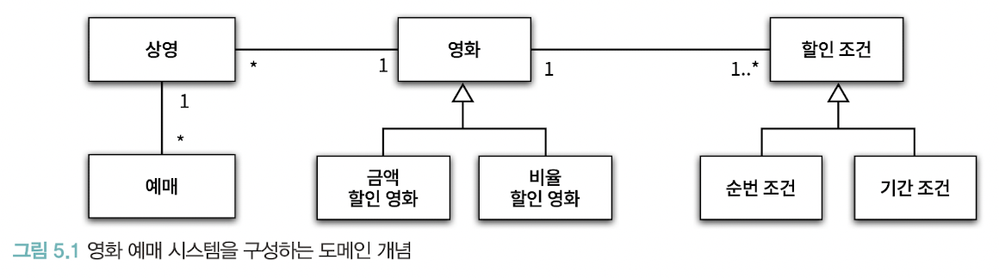
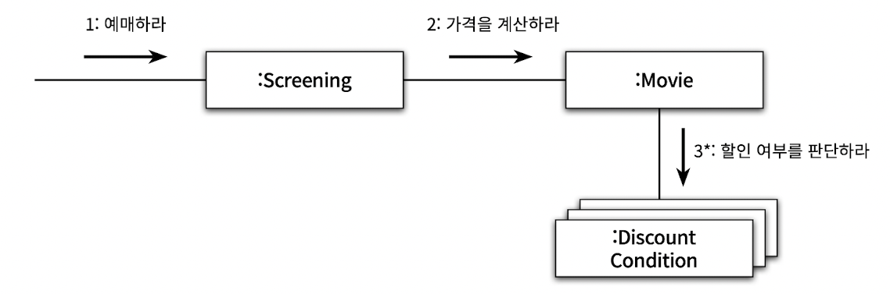
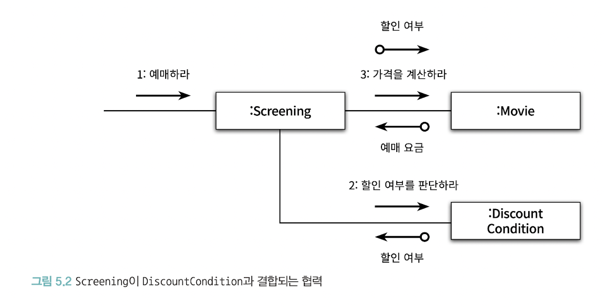
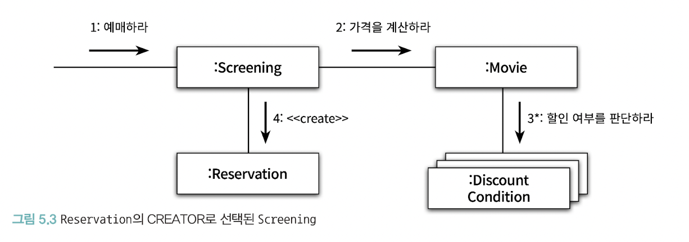
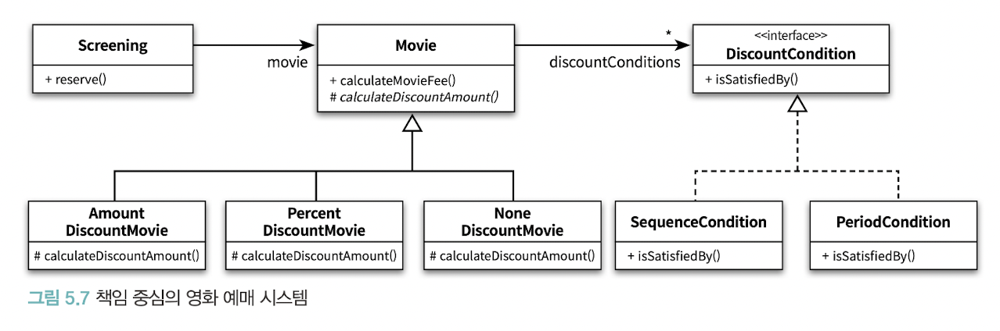
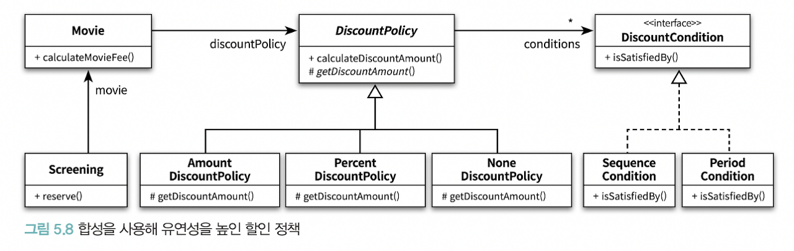
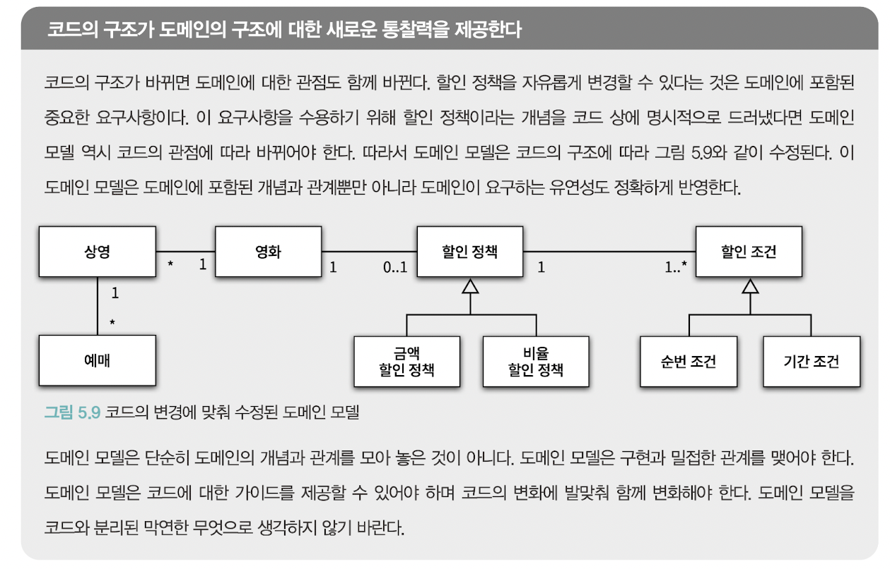

# ch05. 책임 할당하기

데이터 중심 설계로 인한 문제점 해결 방법은 책임에 초점을 맞추는 것

책임 할당 과정은 일종의 트레이드오프 활동. 다양한 관점에서 설계 평가 필요 -> GRASP 패턴

## v01. 책임 주도 설계를 향해

책임 중심 설계 두 가지 원칙

- 데이터보다 행동을 먼저 결정하라
- 협력이라는 문맥 안에서 책임을 결정하라

### 데이터보다 행동을 먼저 결정하라

객체가 수행하는 행동이 곧 객체의 책임

책임을 결정한 후에 필요한 데이터를 결정한다

### 협력이라는 문맥 안에서 책임을 결정하라

객체에 할당된 책임의 품질은 협력에 적합한 정도로 결정된다. 협력에 어울리지 않는 책임은 나쁜 책임

객체 입장에서는 책임이 어색해보이더라도 협력에 적합하면 좋은 책임

협력을 시작하는 주체는 메세지 전송자이기 때문에 전송자(클라이언트)에게 적합한 책임을 할당해야 한다.

이를 위해 메세지를 결정한 후에 객체 선택을 해야한다.

클래스 기반 설계가 아닌 메세지 기반 설계

메세지를 먼저 설계하니 수신자에 대한 가정이 불가능. 자연스럽게 캡슐화가 됨. 캡슐화 원리를 지키기 쉬워진다.

### 책임 주도 설계

흐름 나열

1. 시스템이 사용자에게 제공해야 하는 기능인 시스템 책임을 파악한다.
2. 시스템 책임을 더 작은 책임으로 분할한다.
3. 분할된 책임을 수행할 수 있는 적절한 객체 또는 역할을 찾아 책임을 할당한다.
4. 객체가 책임을 수행하는 도중 다른 객체의 도움이 필요한 경우 이를 책임질 적절한 객체 또는 역할을 찾는다.
5. 해당 객체 또는 역할에게 책임을 할당함으로써 두 객체가 협력하게 한다.

책임을 결정한 후에 수행한 객체를 찾는다.

## v02. 책임 할당을 위한 GRASP 패턴

General Responsibility Assignment Software Patterns - 일반적인 책임 할당을 위한 소프트웨어 패턴

### 도메인 개념에서 출발하기

도메인 개념들을 책임 할당의 대상으로 사용하면 코드에 도메인의 모습을 투영하기가 수월하다.

설계를 시작하는 단계에서는 개념들의 의미와 관계가 정확하거나 완벽할 필요 없음. 도메인 개념 정리에 너무 많은 시간을 들이는 것 보다 빠르게 설계와 구현을 진행하는게 더 좋음



이 도메인 개념으로 설계 시작

#### 올바른 도메인 모델이란 존재하지 않는다

올바른 구현을 이끌어낼 수 있으면 모두 올바른 도메인 모델

도메인 모델 안에 포함된 개념과 관계는 구현의 기반이 돼야 한다. 따라서 도메인 모델은 구현을 염두에 두고 구조화 되어야 한다.

하지만 코드를 구현하며 얻게 되는 통찰이 역으로 도메인에 대한 개념을 바꾸기도 한다.

따라서 도메인을 그대로 투영한 모델이 아닌 구현에 도움이 되는 모델이 필요하다. 실용적이면서도 유용한 모델이 좋다.

### 정보 전문가에게 책임을 할당하라

책임 주도 설계 첫 단계는 애플리케이션이 제공해야 하는 기능을 애플리케이션의 책임으로 생각하는 것

이 책임을 메세지로 간주하고 책임질 첫 번째 객체를 선택한다.

사용자에게 제공해야 하는 기능은 영화를 예매하는 것이므로 애플리케이션은 영화를 예매할 책임이 있다.

이걸 수행하는데 필요한 메세지를 결정해야 하는데, 전송할 객체의 의도를 반영해서 결정해야 한다.

1. 메세지를 전송할 객체는 무엇을 원하는지 알아내야 한다. 그리고 메세지를 수신할 적합한 객체를 찾아야 한다.
    - 이에 따라 메세지 이름은 `예매하라` 라고 정한다.
    - 객체는 상태와 행동을 통합한 캡슐화의 단위
    - 책임을 수행하는데 필요한 상태는 동일한 객체 안에 존재해야 한다.
    - 따라서 책임을 할당하는 첫 번째 원칙은 책임을 수행할 정보를 알고 있는 객체에게 책임을 할당하는 것이다.
    - `Information Expert(정보 전문가)` 패턴
        - 정보와 행동을 최대한 가까운 곳에 위치시키기 때문에 캡슐화 유지 가능
        - 필요한 정보를 가진 객체들로 책임이 분산되기 때문에 더 응집력 있고 이해하기 쉬워진다. 결과적으로 결합도가 낮아져서 간결하고 유지보수하기 쉬운 시스템 구축 가능
        - 객체가 정보를 알고 있다 해서 그 정보를 저장하고 있을 필요는 없음
        - 정보 제공을 해주는 다른 객체를 알고 있거나, 필요한 정보를 계산해서 제공할 수도 있음
    - 예매에 필요한 정보를 가장 많이 알고 있는 `상영(Screening)` 이라는 도메인 개념이 적합할 것

2. 책임 수행하는데 필요한 작업을 구상해보고 스스로 처리할 수 없는 작업은 외부에 도움을 요청한다. -> 새로운 메세지
    - `예매하라` 메세지 완료를 위해서는 예매 가격 계산 작업이 필요. Screening은 가격 계산에 대한 정보를 모르기 떄문에 외부 객체에게 도움을 요청해야 함
    - `가격을 계산하라` 메세지 추가
    - 메세지 책임질 객체 선택 -> 가격 계산하는데 필요한 정보를 가진 전문가는 `영화(Movie)` 객체
3. 영화는 할인 여부 판단이 불가능. 할인 여부 판단 메세지를 보내야 함. 그리고 관련 정보를 가장 잘 아는 `할인 조건(DiscountCondition)`에게 책임을 할당
    - DiscountCondition은 할인 여부 판단을 위해 필요한 모든 정보를 가지고 있음 따라서 외부 도움 없이도 스스로 할인 여부 판단 가능
    - 따라서 메세지 전송 하지 않음



### 높은 응집도와 낮은 결합도

방금 설계한 구조에서는 할인 요금 계산을 위해 Movie가 메세지 전송

Screening이 DiscountCondition과 협력한다면?



할인 여부 판단 메세지를 보낸 뒤 결과값을 Movie에 전달하는 방식

기능은 똑같다. 하지만 응집도와 결합도가 다르다.

여러 협력 패턴 중 높은 응집도와 낮은 결합도를 얻을 수 있는 설계가 있다면 그 설계를 선택해야 한다.

Low Coupling(낮은 결합도) 패턴, High Cohesion(높은 응집도) 패턴

#### Low Coupling 패턴

의존성을 낮추고 변화의 영향을 줄이며 재사용성을 증가시키는 방법

그림 5.1.의 도메인 개념에서 Moive는 DiscountCondition의 목록을 속성으로 가지고 있다. 

Movie와 DiscountCondition은 이미 결합되어 있다. 

따라서 Movie를 DisccountCondition과 협력하게 하면 결합도 추가 없이도 협력 완성 가능

따라서 Low Coupling 패턴 관점에서는 Movie가 DiscountCondition과 협력하는 것이 더 좋다.

#### High Cohesion 패턴

응집도가 높으면 복잡성이 낮아진다.

Screening의 가장 중요한 책임은 예매 생성

Screening이 DiscountCondition과 협력하면 Screening은 영화 요금 계산과 관련된 책임을 일부 지게 된다. 

Movie가 할인 여부를 필요로 한다는 사실을 알아야 하기 때문

따라서 요금 계산 방식이 변경되면 Screening도 변경해야 한다.

Screening은 서로 다른 이유로 변경되는 책임을 짊어지게 되므로 응집도가 낮아진다.

Movie의 주된 책임은 영화 요금 계산. 따라서 DiscountCondition과 협력하는 것은 응집도를 떨어트리지 않는다.

따라서 High Cohesion 패턴 관점에서도 Movie가 DiscountCondition과 협력하는 것이 더 좋다.

### 창조자에게 객체 생성 책임을 할당하라

영화 예매 협력의 최종 결과물은 Reservation 객체. 누군가는 이걸 생성할 책임을 가져야 한다. 이럴때 Creator(창조자) 패턴 사용 가능

#### Creator 패턴

객체 A를 생성해야 할때 아래 조건을 최대한 많이 만족하는 B에게 책임 할당
- B가 A 객체를 포함하거나 참조
- B가 A 객체를 기록
- B가 A 객체를 긴밀하게 사용
- B가 A 객체를 초기화하는데 필요한 데이터를 가지고 있음(B가 정보전문가)

어떤 방식으로든 생성되는 객체와 연결되거나 관련될 필요가 있는 객체에 생성 책임을 맡김

잘 알고 있어야 하거나 사용해야 하는 객체는 어떤 방식으로든 연결됨

이미 결합된 객체에게 생성 책임을 할당하면 결합도에 영향을 미치지 않으므로 낮은 결합도 유지 가능

Reservation을 잘 알고 있는건 Screening. 예매 정보 생성에 필요한 정보 전문가이며 예매 요금 계산에 필요한 Movie도 알고 있음



## v03. 구현을 통한 검증

### DiscountCondition 개선하기

문제점 변경의 이유가 여러가지 -> 변경에 취약한 클래스

1. 새로운 할인 조건 추가
   - isSatisfiedBy 메서드 안의 if-else 문이 수정이 필요해짐. 새로운 데이터 요구 시 속성도 추가해야 함.
2. 순번 조건을 판단하는 로직 변경
   - isSatisfiedBySequence 메서드 내부 구현 수정 필요. 판단 조건 바뀌면 속성 변경 되어야 함
3. 기간 조건 판단 로직 변경
   - isSatisfiedByPeriod 메서드 내부 구현 수정 필요. 판단 조건 바뀌면 dayOfWeek, startTime, endTime 속성 변경 필요

하나 이상의 변경 이유를 가지면 응집도가 낮음. 변경의 이유에 따라 클래스 분리 필요

isSatisfiedBySequence, isSatisfiedByPeriod 메서드는 서로 다른 이유로 변경됨. 또한 변경 시점도 서로 다를 수 있음

설계 개선할때 변경의 이유가 하나가 넘는 클래스를 찾는 것 부터 시작

변경의 이유 찾는 방법
1. 인스턴스 변수가 초기화되는 시점이 다른 경우 함께 초기화되는 속성을 기준으로 코드 분리
2. 메서드들이 인스턴스 변수를 사용하는 방식(혹은 종류)가 다르면 속성 그룹과 해당 그룹에 접근하는 메서드 그룹을 기준으로 코드 분리

#### 클래스 응집도 판단하기

1. 클래스가 하나 이상의 이유로 변경돼야하면 응집도가 낮은 것. 변경의 이유를 기준으로 클래스 분리
2. 인스턴스 초기화 하는 시점이 다르면 속성을 기준으로 클래스 분리
3. 메서드 그룹이 속성 그룹을 다르게 사용하면 해당 그룹을 기준으로 클래스 분리

응집도 낮으면 보통 세 가지 문제 같이 가짐

### 타입 분리하기

가장 쉬운 방법은 DiscountCondition 을 독립적인 두 타입을 두 개의 클래스로 분리 하는 것

```kotlin
class PeriodCondition(
    private val dayOfWeek: DayOfWeek,
    private val startTime: LocalTime,
    private val endTime: LocalTime
) {
    fun isSatisfiedBy(screening: Screening): Boolean {
        return screening.whenScreened.dayOfWeek == dayOfWeek &&
                startTime <= screening.whenScreened.toLocalTime() &&
                endTime >= screening.whenScreened.toLocalTime()
    }
}

class SequenceCondition(
   private val sequence: Int
) {
    fun isSatisfiedBy(screening: Screening): Boolean {
        return screening.sequence == sequence
    }
}
```

Movie 인스턴스는 두 개의 서로 다른 클래스의 인스턴스 모두와 협력할 수 있어야 한다.

그래서 Movie 안에서 각 목록을 따로 유지

```kotlin
class Movie(
    private val periodConditions: List<PeriodCondition>,
    private val sequenceConditions: List<SequenceCondition>
) {
    private fun isDiscountable(screening: Screening): Boolean {
       return periodConditions.any { it.isSatisfiedBy(screening) } ||
               sequenceConditions.any { it.isSatisfiedBy(screening) } 
    }
}
```

그런데 이렇게 하면 Movie 클래스가 두 클래스 모두에 결합된다. 

이전에는 Movie 는 하나의 클래스와 결합되어 있었기 떄문에 결합도가 높아진 것

또한 새로운 할인조건 추가하려면 Movie 클래스에 속성 추가해야함

응집도는 높아졌어도 결합도가 낮아졌음

### 다형성을 통해 분리하기

Movie 입장에서는 두 클래스는 동일한 책임을 가진다. 할인 여부 판단 방법이 다른 것이지, 보내는 메세지는 동일

이러면 역할의 개념 적용. 배역은 DiscountCondition, 배우는 PeriodCondition, SequenceCondition

```kotlin
interface DiscountCondition {
    fun isSatisfiedBy(screening: Screening): Boolean
}

// class PeriodCondition: DiscountCondition {  }
// class SequenceCondition: DiscountCondition {  }

class Movie(
    private val discountConditions: List<DiscountCondition>
) {
    private fun isDiscountable(screening: Screening): Boolean {
        return discountConditions.any { it.isSatisfiedBy(screening) }
    }
}
```

객체의 타입에 따라 변하는 행동이 있다면 타입 분리 후 변화하는 행동을 각 타입의 책임으로 할당한다.

이를 Polymorphism(다형성) 패턴이라고 한다.

#### Polymorphism 패턴

객체의 타입에 따라 변하는 로직이 있다면 타입을 명시적으로 정의하고 각 타입에 다형적으로 행동하는 책임 할당

프로그램을 조건문을 사용해서 설계하면 새로운 변화가 일어난 경우 조건 논리를 수정해야 함 -> 수정하기 어렵고 변경에 취약해짐

다형성을 이용하면 새로운 변화를 다루기 쉽게 확장

### 변경으로부터 보호하기

DiscountCondition 의 서브 클래스는 서로 다른 이유로 변경된다. 하지만 Movie 는 이를 알지 못한다. 인터페이스가 존재를 감춰준다.

Movie 의 관점에서 DiscountCondition 의 타입이 캡슐화 된다는 것은 새로운 DiscountCondition 타입을 추가하더라도 Movie 가 영향을 받지 않는 다는 것

변경을 캡슐화 하는 것을 Protected Variations(변경 보호) 패턴이라고 한다.

#### Protected Variations 패턴

책임 할당의 관점에서 캡슐화를 설명하는 것. 변하는 것이 묻엇인지 고려하고 변하는 개념을 캡슐화 하라

변화가 예상되는 불안정한 지점들을 식별하고 그 주위에 안정된 인터페이스를 형성하도록 책임을 할당

변경될 가능성이 높으면 캡슐화

하나의 클래스가 여러 타입의 행동을 구현하고 있으면 다형성 패턴으로 책임 분산

예측 가능한 변경으로 여러 클래스들이 불안정해지면 변경 보호 패턴으로 인터페이스 뒤로 변경을 캡슐화

두 패턴을 적절한 상황에서 조합


### Movie 클래스 개선하기

금액 할인 정책 영화와 비율 할인 정책 영화라는 두 가지 타입을 구현하기 때문에 변겨의 이유가 여러가지다. -> 응집도가 낮다.

Polymorphism 패턴을 이용하면 Screening과 Moive가 다형적으로 협력한다. 그러면 Movie의 타입이 늘어나도 Screening에는 영향을 끼치지 않는다.

이러면 Protected Variations 패턴을 적용하여 캡슐화 할 수 있다는 것을 의미

```kotlin
// Movie의 경우에는 구현을 공유해야하니 추상 클래스로 역할 구현
abstract class Movie(
    private val title: String,
    private val runningTime: Duration,
    protected val fee: Money,
    private val discountConditions: List<DiscountCondition>
) {
    fun calculateMovieFee(screening: Screening): Money {
        return if (isDiscountable(screening)) {
            fee - calculateDiscountAmount()
        } else {
            fee
        }
    }

    private fun isDiscountable(screening: Screening): Boolean {
        return discountConditions.any { it.isSatisfiedBy(screening) }
    }

    protected abstract fun calculateDiscountAmount(): Money
}

class AmountDiscountMovie(
    title: String,
    runningTime: Duration,
    fee: Money,
    discountConditions: List<DiscountCondition>,
    private val discountAmount: Money = Money.ZERO
): Movie(
    title,
    runningTime,
    fee,
    discountConditions
) {

    override fun calculateDiscountAmount() = discountAmount
}

class PercentDiscountMovie(
    title: String,
    runningTime: Duration,
    fee: Money,
    discountConditions: List<DiscountCondition>,
    private val percent: Double = 0.0
): Movie(
    title,
    runningTime,
    fee,
    discountConditions
) {
    override fun calculateDiscountAmount() = fee * percent
}
```



이제 모든 클래스 내부 구현은 캡슐화 돼있고, 클리스들은 변경의 이유를 하나씩만 가진다.

각 클래스는 응집도가 높고 느슨하게 결합돼있다. 클래스는 작고 한 가지 일만 수행하고 책임이 적절하게 분배돼있다.

이것이 책임 중심 협력 설계의 이점

데이터 중심 설계는 이와 반대

#### 도메인 구조가 코드의 구조를 이끈다

도메인 모델의 구조와 완성된 클래스 구조가 유사하다.

도메인 모델은 설계 용어 제공을 넘어 코드 구조에도 영향을 미친다.

변경 역시 도메인 모델의 일부다. 도메인 모델에서는 도메인 안에서 변하는 개념과 이들 사이의 관계가 투영돼있어야 한다.

도메인 모델에 변경에 대한 직관이 반영돼있으면 설계에 유연성을 줄 수 있다.

따라서 구현을 가이드할 수 있는 도메인 모델을 선택해야 한다.

### 변경과 유연성

변경에 대비할 수 있는 두 가지 방법

- 코드를 이해하고 수정하기 쉽도록 최대한 단순하게 설계하는 것
- 코드를 수정하지 않고도 변경을 수용할 수 있도록 코드를 유연하게 만드는 것

대부분의 경우 전자가 더 좋은 방법이지만 유사한 변경이 반복적으로 발생한다면 복잡성 상승을 감수하고 두 번째 방법을 선택하는게 좋다.

새로운 정책이 추가될때마다 해야할게 많으면 번거로울 뿐만 아니라 오류 가능성도 높인다. 그러면 복잡성을 높이더라도 변경을 쉽게 수용할 수 있게 하는게 더 좋다.

상속 대신 합성을 사용하면 더 유연한 설계가 된다.



이러면 2장에서 봤던 영화 예매 시스템의 구조가 된다.

이러면 정책 바꾸는게 코드 레벨에서 가능해진다.

```kotlin
movie = Movie(
    "반지의 제왕",
    Duration.ofMinutes(180),
    Money.wons(10000),
    listOf(PeriodCondition(DayOfWeek.FRIDAY, LocalTime.of(14, 0), LocalTime.of(16, 0))
    )
)
movie.changeDiscountPolicy(PercentDiscountPolicy(0.1))
```

#### 코드의 구조가 도메인의 구조에 대한 새로운 통찰력을 제공한다.



 코드 구조가 바뀌면 도메인에 대한 관점도 바뀐다.
 
할인 정책을 자유롭게 변경할 수 있다는 것은 도메인에 포함된 중요 요구사항인데, 
이 요구 사항을 수용하기 위해 할인 정책이라는 개념을 코드에 명시적으로 드러냈다.

그렇다면 도메인 모델 역시 코드 관점에 따라 바뀌어야 한다. 도메인 모델은 개념과 관계 뿐만 아니라 유연성도 반영한다.

도메인 모델은 코드에 대한 가이드를 제공하고 코드의 변화와 함께 변화해야 한다.

