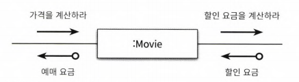
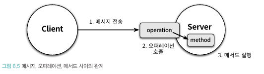

# ch06. 메시지와 인터페이스

클래스가 아닌 객체를 지향해야 함 ->협력 안에서 객체가 수행하는 책임에

책임은 객체가 수신할 수 있는 메시지의 기반이 됨

객체지향의 가장 중요한 재료는 클래스가 아니라 객체들이 주고받는 메시지

애플리케이션은 객체로 구성되지만 메시지를 통해 정의된다.

객체가 수신하는 메시지가 퍼블릭 인터페이스를 구성함

책임 주도 설계를 따르는 것만으로는 부족함

## v01. 협력과 메시지

### 클라이언트-서버 모델

메시지는 협력을 가능하게 하는 메개체

협력 관계를 설명할때 클라이언트-서버 모델에 비유를 한다.

메세지 전송 객체는 클라이언트 수신 객체는 서버. 협력은 클라이언트가 서버를 요청하는 단방향 상호작용

객체는 협력에 참여하는 동안 클라이언트와 서버의 역할을 동시에 수행한다.



협력의 관점에서 객체는 두 가지 메시지 집합으로 구성

- 객체가 수신하는 메시지의 집합
- 외부의 객체에게 전송하는 메시지의 집합

### 메시지와 메세지 전송

- 메시지(message): 객체들이 협력하기 위해 사용할 수 있는 유일한 의사소통 수단
    - 오퍼레이션 명(operation name)과 인자(argument)로 구성. (e.g. `isSatisfiedBy(screening)`)
- 메시지 전송(message sending) | 메시지 패싱(message passing): 한 객체가 다른 객체에게 도움을 요청
    - 메시지에 메시지 수신자를 추가한 것 (e.g. `condition.isSatisfiedBy(screening)`)
- 메시지 전송자(message sender) | 클라이언트: 메시지를 전송하는 객체
- 메시지 수신자(message receiver) | 서버: 메시지를 수신하는 객체

### 메시지와 메서드

- 메서드: 메시지를 수신했을때 실제로 실행되는 함수 또는 프로시저. 오퍼레이션의 구현.

메시지를 수신했을때 어떤 코드가 실행될지는 메시지 수신자의 실제 타입이 무엇인가에 따라 달라짐.

객체는 메시지와 메서드라는 다른 개념을 런타임에 연결해야 함. 컴파일 시점과 실행 시점에 차이가 생김.

코드레벨에서는 뭐가 실행될지 정확히 알 수 없음.

메시지와 메서드가 구분되기 떄문에 메시지 전송자와 수신자가 느슨하게 결합됨. 결합도가 낮아져서 유연하고 확장가능한 코드 작성됨

### 퍼블릭 인터페이스와 오퍼레이션

- 퍼블릭 인터페이스: 객체가 의사소통을 위해 외부에 공개하는 메시지의 집합
    - 외부에서 볼때 객체의 안쪽은 블랙박스
- 오퍼레이션(operation): 퍼블릭 인터페이스에 포함된 메시지. 수행가능한 어떤 행동에 대한 추상화
    - 오퍼레이션이라 부를때는 내부의 구현 코드는 제외하고 단순히 메시지와 관련된 시그니처를 가키는 경우가 대부분
    - 실제로 실행되는 코드는 메서드라고 부름. 오퍼레이션이 여러 구현 중 하나



프로그래밍 언어 관점에서 객체가 다른 객체에게 메시지를 전송하면

1. 런타임 시스템은 메시지 전송을 오퍼레이션 호출로 해석
2. 메시지를 수신한 객체의 실제 타입을 기반으로 적절한 메서드를 찾아 실행
   따라서 퍼블릭 인터페이스 메시지의 관점에서 보면 메서드 호출 보다는 오퍼레이션 호출이 더 적절함

### 시그니처

- 시그니처(signature): 오퍼레이션 또는 메소드의 이름과 파라미터 목록을 합친 것.
    - 오퍼레이션은 실행코드 없이 시그니처만을 정의한 것
    - 메서드는 이 시그니처에 구현을 더한 것
    - 메시지를 수신하면 일반적으로 시그니처와 동일한 메소드가 실행됨

오퍼레이션 관점에서 다형성이란 동일한 오퍼레이션 호출에 대해 서로 다른 메서드들이 실행되는 것

## v02. 인터페이스와 설계 품질

인터페이스 품질에 영향 미치는 원칙과 기법

- 디미터 법칙
- 묻지말고 시켜라
- 의도를 드러내는 인터페이스
- 명령-쿼리 분리

### 디미터 법칙

- 객체의 내부구조에 강하게 결합되지 않도록 협력 경로 제한(점을 하나만 찍자?!)
- 모든 클래스 C와 C에 구현된 모든 메소드 M에 대해서 M이 메시지를 전송할수 있는 모든 객체는
    - M의 인자로 전달된 클래스(C 자체를 포함)
    - C의 인스턴스 변수의 클래스
- 아래 조건을 만족하면 됨
    - this 객체
    - 메서드의 매개변수
    - this의 속성
    - this의 속성인 컬렉션의 요소
    - 메서드 내에서 생성된 지역 객체
- 부끄럼 타는 코드(shy code) - 불필요한 것들은 다른 객체에 보여주지 않고, 다른 객체의 구현에 의존하지 않는다
- 디미터법칙은 캡슐화를 다른 관점에서 표현한 것
- 내부 구조에 대해 물어보고 변환받은 요소에 대해 연쇄적으로 메세지 전송하게 되면 기차 충돌(train wreck)이 발생한 것
    - 이러면 클래스 내부 구현이 외부로 노출되고 캡슐화 무너지고 메세지 전송자가 수신자의 내부 구조에 강하게 결합됨

### 묻지말고 시켜라

- 디미터 법칙을 지키려면 객체의 상태에 관해 묻지 말고 원하는 것을 시켜야 한다. 묻지말고 시켜라(tell, don't ask)는 이런 스타일을 장려하는 것.
- 객체가 어떻게 작업을 수행하는지를 노출하면 안 됨 무엇을 하는지를 서술해야 함

### 의도를 드러내는 인터페이스

인터페이스 이름에 의도를 나타내면 좋지 않다

예를 들어,

```kotlin
class PeriodCondition {
    fun isSatisfiedByPeriod(screening: Screening): Boolean { /* ... */
    }
}

class SequenceCondition {
    fun isSatisfiedBySequence(screening: Screening): Boolean { /* ... */
    }
}
```

이런 스타일이 좋지 않은 이유

- 메서드에 대해 제대로 커뮤니케이션하지 못 함.
    - 클라이언트 관점에서는 둘 다 할인 조건을 판단하는 동일한 작업
    - 메서드 이름이 다르니 내부 구현을 모르면 동일한 작업을 하는지 알 수 없음
- 메서드 수준에서 캡슐화 위반
    - 이렇게 구현하면 협력 하는 객체의 종류를 알도록 강요함
    - 그러면 방법이 바뀔때 이름도 변경되어야 하는데, 클라이언트 코드도 함께 변경되어야 함 -> 변경에 취약해진다.

메서드 이름은 어떻게가 아니라 무엇을 하는지 드러내야함.

이 기준으로 메소드를 만들면

```kotlin
class PeriodCondition : DiscountCondition {
    override fun isSatisfiedBy(screening: Screening): Boolean { /* ... */
    }
}

class SequenceCondition : DiscountCondition {
    override fun isSatisfiedBy(screening: Screening): Boolean { /* ... */
    }
}
```

이러면 클라이언트 입장에서는 같은 목적이지만 방법이 두가지가 된다. 그리고 서로 대체 가능해짐

이런 패턴을 의도를 드러내는 선택자(intention revealing selector)라고 부름

DDD에서는 이런 패턴을 의도를 드러내는 인터페이스(intention revealing interface)를 제시했음. 구현과 관련된 모든 정보 캡슐화, 인터페이스에는 의도만 표현

### 함께 모으기

1장에서 만든 코드에 이런 원칙을 위반하는 코드가 나온다.

#### 디미터 법칙을 위반하는 티켓 판매 도메인

[Theater.kt](../ch01/v1/Theater.kt)

enter 메소드에 있는 코드에 기차충돌이 나타난다

`audience.bag.minusAmount(ticket.fee)`

audience 내부의 bag에게 메세지 전송한다. 이러면 Theater는 Audience의 내부 구조에 결합된다.

디미터 법칙을 위반하면 인터페이스와 구현의 분리 원칙을 위반하는 것

이런 코드는 사용하기도 어렵다. 내부 구조까지 알아야 하니까

```kotlin
val ticket = ticketSeller.ticketOffice.getTicket()
audience.bag.setTicket(ticket)
ticketSeller.ticketOffice.plusAmount(ticket.fee)
audience.bag.minusAmount(ticket.fee)
```

위 코드에 따르면 Theater는 TicketSeller가 getTicketOffice 메세지를 수신할 수 있다는 사실,

그리고 내부에 TicketOffice가 있다는 사실,

반환된 TicketOffice가 getTicket 메세지를 수신할 수 있고 Ticket이 getFee 메세지를 수신할 수 있다는 사실을 알아야 한다.

#### 묻지말고 시켜라

원칙 준수하도록 리팩토링

1. Ticket 내부 로직 TicketSeller로 이동 ([v02_1](v02_1))
2. TicketSeller 내부 로직 Audience로 이동 ([v02_2](v02_2))
3. Audience 내부 로직 Bag으로 이동[v02_3](v02_3)

#### 인터페이스에 의도를 드러내자

위에서 리팩토링한 메소드는 모드 setTicket이라는 메소드 명이다.

이 메소드 명으로 어떤 의도인지 나타내지 못한다. 이름이 같은 각 메소드들의 의도가 다른 메소드들과 의도가 다르다

개발자는 알고 있지만 인터페이스를 사용하는 개발자는 알기 어렵다.

이런식으로 하면 의도가 명확해진다.

```kotlin
class TicketSeller {
    fun sellTo(audience: Audience) { /* ... */
    }
}

class Audience {
    fun buy(ticket: Ticket) { /* ... */
    }
}

class Bag {
    fun hold(ticket: Ticket) { /* ... */
    }
}
```

오퍼레이션의 이름은 협력이라는 문맥을 반영해야 한다. 클라이언트가 객체에게 무엇을 원하는지 표현해야 한다.

디미터 법칙은 캡슐화 위반 메세지가 인터페이스에 포함되지 않도록 도와준다.

묻지않고 시켜라 원칙은 디미터 법칙을 준수하는 협력을 만들기 위한 스타일

의도를 드러내는 인터페이스 원칙은 어떤 이름이 드러나야 하는지에 대한 가이드

## v03. 원칙의 함정

설계원칙이 절대적인 법칙은 아니다. 원칙에는 예외가 있다.

### 디미터 법칙은 하나의 도트(.)를 강제하는 규칙이 아니다

디미터 법칙을 하나의 도트만 사용하라고 요약하는데, 기차 충돌처럼 보이더라도 객체의 내부 구현에 대한 어떤 정보도 외부로 노출하지 않는다면 상관없다.

`IntStream.of(1, 2, 3, 10, 111, 13).filter(x -> x > 10).distinct().count()`

위 코드는 IntStream의 인스턴스를 또 다른 IntStream의 인스턴스로 변환하는 것이다. 이런 경우 내부구조가 노출되지 않는다.

### 결합도와 응집도의 충돌

디미터 법칙과 묻지말고 시켜라 원칙을 맹목적으로 준수하면 응집도가 낮아질 수 있다. 변경 원인이 달라질 수 있기 떄문에

```kotlin
class PeriodCondition : DiscountCondition {
    override fun isSatisfiedBy(screening: Screening): Boolean {
        return screening.startTime.dayOfWeek == dayOfWeek &&
                startTime >= screening.startTime.toLocalTime() &&
                endTime <= screening.startTime.toLocalTime()
    }
}
```

얼핏 보면 Screening의 내부 상태를 가져오니 캡슐화를 위반한 것 처럼 보인다.

```kotlin
class Screening {
    fun isDiscountable(dayOfWeek: DayOfWeek, startTime: LocalTime, endTime: LocalTime): Boolean {
        return this.startTime.dayOfWeek == dayOfWeek &&
                startTime <= whenScreened.toLocalTime() &&
                endTime >= whenScreened.toLocalTime()
    }
}

class PeriodCondition : DiscountCondition {
    override fun isSatisfiedBy(screening: Screening): Boolean {
        return screening.isDiscountable(dayOfWeek, startTime, endTime)
    }
}
```

이렇게 하면 Screening이 기간에 따른 할인 조건을 판단하는 책임을 갖게 된다. 이건 Screening이 담당해야 할 책임이 아니다.

Screening의 본질적은 책임은 영화를 예매하는 것. 변경할 이유가 두 개가 된다. 이러면 응집도가 낮아진다.

예외적인 경우로 묻지 않으면 방법이 없는 경우도 있다.

```kotlin
for (movie in movies) {
    total += movie.fee
}
```

물으려는 객체가 정말로 데이터인 경우도 있다. 만약 객체가 아니라 자료 구조라면 당연히 외부에 내부를 노출해야 한다.

## v04. 명령-쿼리 분리 원칙

필요에 따라 물어야 한다. 이럴땐 명령-쿼리 분리(Commend-Query Separation, CQS) 원칙을 생각해보면 된다. 

퍼블릭 인퍼테이스의 오퍼레이션 정의에 도움이 된다.

절차를 묶어 호출 가능하도록 이름을 부여한 기능 모듈을 루틴(rooutine)이라고 부른다.

루틴은 프로시저(procedure)와 함수(function)로 구분된다.

- 프로시저 -> 명령(command): 객체 상태 변경
  - 정해진 절차에 따라 내부의 상태를 변경하는 루틴
  - 부수효과 발생
- 함수 -> 쿼리(query): 객체 정보 반환
  - 필요한 값을 계산해서 반환하는 루틴
  - 부수효과 발생하면 안 됨

명령-쿼리 분리 원칙을 한 문장으로 표현하면 질문이 답변을 수정해서는 안 된다는 것

기계 메타포 
- 객체는 블랙박스
- 인터페이스는 디스플레이와 버튼의 집합
- 명령 버튼을 누르면 기계의 상태 변경
- 쿼리 버튼을 누르면 상태 확인

### 반복 일정의 명령과 쿼리 분리하기

- 이벤트: 특정 일자에 실제로 발생하는 사건
- 반복일정: 일주일 단위로 돌아오는 특정 시간 간격에 발생하는 사건 전체를 포괄적으로 지칭하는 용어
  - 반복일정을 만족하는 특정 일자와 시간에 발생하는 사건이 이벤트

```kotlin
class Event(
    private val subject: String,
    private var from: LocalDateTime,
    private var duration: Duration
) {
    fun isSatisfied(schedule: RecurringSchedule): Boolean {
        if (from.dayOfWeek != schedule.dayOfWeek ||
            from.toLocalTime() != schedule.from ||
            duration != schedule.duration
        ) {
            reschedule(schedule)
            return false
        }
        return true
    }
  
    private fun reschedule(schedule: RecurringSchedule) {
        from = LocalDateTime.of(
            from.toLocalDate().plusDays(daysDistance(schedule)),
            schedule.from
        )
        duration = schedule.duration
    }
}

class RecurringSchedule(
    private val subject: String,
    val dayOfWeek: DayOfWeek,
    val from: LocalTime,
    val duration: Duration
)
```

발생했던 버그
- `isSatisfied(RecurringSchedule)`: 해당 이벤트가 일정 조건을 만족하면 true, 아니면 false 반환

```kotlin
val schedule = RecurringSchedule("회의", DayOfWeek.WEDNESDAY, LocalTime.of(10, 30), Duration.ofMinutes(30))
val meeting = Event("회의", LocalDateTime.of(2019, 5, 9, 10, 30), Duration.ofMinutes(30))

assert(meeting.isSatisfied(schedule)) == false
assert(meeting.isSatisfied(schedule)) == true
```
isSatisfied 를 할 때마다 상태가 바뀐다.

문제는 스케줄 조건을 만족하지 못할 경우 Event의 상태를 변경한다는 것이다.

명령과 쿼리의 두 가지 역할을 동시에 수행하고 있었기 떄문에 버그를 찾기 어려웠는데 isSatisfied가 부수효과를 가질 것이라고 예상하기 힘들기 때문이다.

처음에는 없었지만 요구사항 변화에 따라 event 상태 수정이 필요했는데, isSatisfied 안에 해당 코드를 넣어놓은것이다.

쿼리처럼 보이지만 부수효과를 가지는 코드는 이해하기 어렵고 잘못 사용하기 쉬우며, 버그를 양산하는 경향이 있다.

해결책은 명령과 쿼리를 명확하게 분리하는 것

```kotlin
class Event(
    private val subject: String,
    private var from: LocalDateTime,
    private var duration: Duration
) {
    fun isSatisfied(schedule: RecurringSchedule): Boolean {
        if(from.dayOfWeek != schedule.dayOfWeek &&
          from.toLocalTime() != schedule.from &&
          duration != schedule.duration) {
            return false
        }
        return true
    }
  
    fun reschedule(schedule: RecurringSchedule) {
        from = LocalDateTime.of(
            from.toLocalDate().plusDays(daysDistance(schedule)),
            schedule.from
        )
        duration = schedule.duration
    }
}
```

이러면 인터페이스만 봐도 어떤게 쿼리고 어떤게 명령인지 알 수 있다(리턴값 유무).

명령과 쿼리를 분리하며 reschedule의 가시성이 public이 되었다. 

이제 이벤트의 만족 여부에 따라 reschedule 호출 여부를 사용하는 쪽에서 결정할 수 있다. 

복삽성이 증가한 것 처럼 보이지만, 코드가 예측 가능하고 이해하기 쉬우며 디버깅이 용이하고 유지보수가 수월해진다.

### 명령-쿼리 분리와 참조 투명성

명령과 쿼리를 분리하면 명령형 언어의 틀 안에서 참조 투명성(referential transparency)의 장점을 가질 수 있다.

컴퓨터와 수학의 가장 큰 차이는 부수효과(side effect)의 유무이다.

참조 투명성
- 어떤 표현식 e가 있을때, e의 값으로 e가 나타나는 모든 위치를 교체하더라도 결과가 달라지지 않는 특성
  - f(1) + f(1) = 6
  - f(1) * 2 = 6
  - f(1) - 1 = 2
- 위 함수의 결과값인 3으로 f(1)을 바꾸더라도 식의 결과는 변하지 않음. 이게 참조 투명성
- 식의 순서를 바꿔도 결과는 달라지지 않음 

위 조건이 만족하기 위해서는 불변성(immutability)이 필요하다. -> 부수효과가 발생하지 않음

참조 투명성을 만족하면 하나의 결과값만 있으면 되니 식을 쉽게 계산할 수 있고 식의 순서를 변경해도 각 식의 결과는 달라지지 않는다.

하지만 객체지향 패러다임은 객체의 상태 변경이라는 부수효과를 기반으로 한다. 따라서 참조 투명성은 예외에 가깝다.

대신 명령-쿼리 분리 원칙을 사용하면 참조 투명성을 어느 정도 달성할 수 있다.

Event 인스턴스의 reschdule을 호출하기 전까지는 isSatisfied를 어떤 순서로 몇 번 호출하건 결과는 동일할 것이다.

#### 명령형 프로그래밍과 함수형 프로그래밍

부수효과를 기반으로 하는 프로그래밍을 명령형 프로그래밍(imperative programming)이라고 한다.

부수효과가 존재하지 않는 수학적인 함수에 기반한 프로그래밍을 함수형 프로그래밍(functional programming)이라고 한다.

참조 투명성의 장점을 가지며, 실행 결과를 이해하고 예측하기 비교적 쉽다.

병렬 처리에 유리하다.

### 책임에 초점을 맞춰라

메세지를 먼저 선택하고 그 후에 메세지를 처리할 객체를 선택
객체 구현 이전에 객체 사이의 협력에 초점을 맞추고 협력방식을 단순하고 유연하게 만드는 것
- 디미터 법칙을 준수하고 묻지말고 시켜라 스타일을 따르면서 의도를 드러내는 인터페이스를 설계하는 쉬운 방법
- 명령과 쿼리를 분리하고 계약에 의한 설계 개념을 통해 객체의 협력방식을 명시적으로 드러내는 방법

- 디미터 법칙: 수신 객체를 알지 못한 상태에서 메세지를 먼저 선택하면 디미터 법칙을 위반할 위험을 최소화 할 수 있다.
- 묻지말고 시켜라: 메세지를 먼저 선택하면 클라이언트의 관점에서 메세지를 선택하기 때문에 정보를 묻지 않아도 됨
- 의도를 드러내는 인터페이스: 클라이언트의 관점에서 메세지 이름을 정하니 의도가 드러남
- 명령-쿼리 분리 원칙: 메세지를 먼저 선택하려면 협력의 컨텍스트 안에서 인터페이스를 고민해야 하기 때문에 예측 가능한 협력을 만드려면 명령과 쿼리를 분리하게 됨

협력을 위해 두 객체가 보장해야 하는 실행 시점의 제약을 인터페이스에 명시할 수 없음 -> 계약에 의한 설계(Design by Contract; 부록 A 참고)
