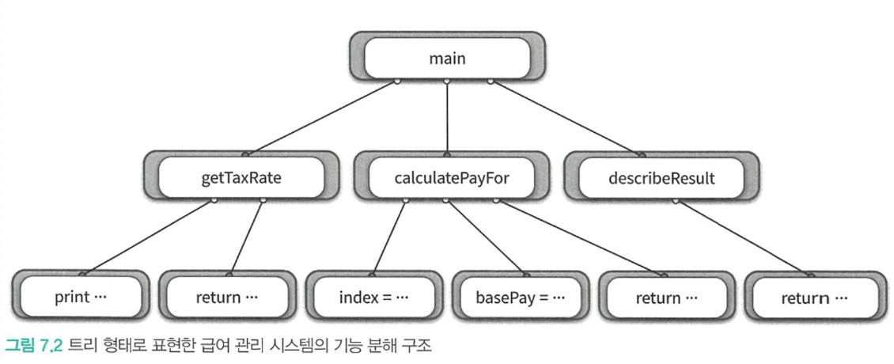

# ch07. 객체 분해

인지과부하(cognitive overload) - 문제 해결에 필요한 단기 기억의 용량을 초과하면 문제 해결 능력이 급격히 떨어지는 현상

방지하려면 불필요한 정보를 제거하고 문제 해결에 필요한 핵심만 남긴다. - 추상화

추상화 - 한 번에 다뤄야 하는 문제의 크기를 줄이는 것

분해(decomposition) - 큰 문제를 해결 가능한 작은 단위로 나누는 것

> 재밌는 예시 - 임의의 11자리 정수 8개를 한꺼번에 기억하기는 어렵지만, 8명의 전화번호 11자리를 기억하는건 비교적 쉬울 것이다.

추상화를 더 큰 규모의 추상화로 압축시키면 단기기억의 한계를 초과할 수 있음 

## v01. 프로시저 추상화와 데이터 추상화

어셈블리어도 로우 레벨 명령어에서 인간 눈높이에 맞는 추상화 제공 시도의 결과

추상화의 발전 -> 프로그래밍 패러다임의 탄생

두 가지 매커니즘
- 프로시저 추상화(Procedural Abstraction)
  - 기능 분해(Functional Decomposition) ~= 알고리즘 분해(Algorithmic Decomposition)
- 데이터 추상화(Data Abstraction)
  - 타입 추상화(Type Abstraction): 추상 데이터 타입(Abstract Data Type)
  - 프로시저 추상화(Procedural Abstraction) - 데이터를 중심으로: 객체 지향(Object-Oriented)

우리가 협력하는 공통체를 구성하도록 객체를 나누는 과정 -> 분해

프로그래밍 언어의 관점에서 객체지향: 데이터를 중심으로 데이터 추상화와 프로시저 추상화를 통합한 객체를 이용해 시스템을 분해하는 방법

이걸 구현하기 위한 도구가 클래스(데이터 추상화 + 프로시저 추상화) -> 객체지향에서는 클래스를 이용해 시스템 분해

## v02. 프로시저 추상화와 기능 분해

### 메인 함수로서의 시스템

기능 분해(알고리즘 분해) - 추상화의 단위가 프로시저

프로시저: 반복적으로 실행되거나 거의 유사하게 실행되는 작업들을 하나의 장소에 모아놓고 재사용 혹은 중복 방지하는 추상화 방법
- 내부를 몰라도 인터페이스만 알면 실행 가능하니 추상화라고 할 수 있음

전통적인 기능 분해 방법은 하향식(Top-Down) 접근법 - 최상위(topmost) 기능을 정의하고 하위 기능으로 분해하는 것

### 급여 관리 시스템

회사는 연초에 기본급에 대해 직원가 협의하고 12개월동안 지급. 급여 지급 시 세율에 따라 세금공제 후 지급

`급여 = 기본급 - (기본급 * 소득세율)`

기능 분해 방법으로 하면 최상위에 있는 메인 프로시저 먼저 -> 직원의 급여를 계산한다.

이걸 분해해보면?

- 직원의 급여를 계산한다.
  - 사용자로부터 소득세율을 입력받는다.
  - 직원의 급여를 계산한다.
  - 양식에 맞게 결과를 출력한다.

정제 가능한 문장이 존재한다면 구현 가능한 수준에서 저수준의 문장이 될 떄 까지 분해

- 직원의 급여를 계산한다.
    - 사용자로부터 소득세율을 입력받는다.
      - "세율을 입력하세요: "라는 문장을 화면에 출력
      - 키보드를 이용해 세율을 입력 받는다
    - 직원의 급여를 계산한다.
      - 전역 변수에 저장된 직원의 기본급 정보를 얻는다
      - 급여를 계산한다
    - 양식에 맞게 결과를 출력한다.
      - "이름: {직원명}, 급여: {계산된 금액}" 형식에 따라 출력 만자열을 생성


기능을 중심으로 필요한 데이터 결정 - 필요한 기능 먼저 생각하고 그 과정에서 필요한 데이터 종류와 저장방식 식별

문제점을 알아보자

### 급여 관리 시스템 구현

우선 최상위 문장인 급여를 계산한다를 main 함수로 잡는다.

하위 세 단계는 세부단계로 분해 가능하기 때문에 프로시저로 표현해준다.

```rb
// 직원의 급여를 계산한다. 이름이 C인 직원의 급여 계산은 `main("직원C")`로 실행
def main(name):
    // 사용자로부터 소득세율을 입력받는다.)
    taxRate = getTaxRate()
    // 직원의 급여를 계산한다.)
    pay = calculatePay(name, taxRate)
    // 양식에 맞게 결과를 출력한다.)
    puts(describeResult(name, pay))
end
```

각 세부단계도 분해하여 프로시저 내부에 구현해준다.

```rb
// 사용자로부터 소득세율을 입력받는다.
def getTaxRate():
    // "세율을 입력하세요: "라는 문장을 화면에 출력
    print("세율을 입력하세요: ")
    // 키보드를 이용해 세율을 입력 받는다
    return gets().chomp().to_f()
end
```

```rb
// 직원 급여 계산을 위해서 전역번수에 직원 목록과 급여에 대해 저장해둬야 한다.
$employees = ["직원A", "직원B", "직원C"]
$basePays = [400, 300, 250]

// 직원의 급여를 계산한다.
def calculatePay(name, taxRate):
    // 전역 변수에 저장된 직원의 기본급 정보를 얻는다
    index = $employees.index(name)
    basePay = $basePays[index]
    // 급여를 계산한다 - 지급 공식에 따라 계산 `기본급 - (기본급 * 소득세율)`
    return basePay - (basePay * taxRate)
end
```

```rb
// 양식에 맞게 결과를 출력한다.
def describeResult(name, pay):
    // "이름: {직원명}, 급여: {계산된 금액}" 형식에 따라 출력 만자열을 생성
    return "이름: #{name}, 급여: #{pay}"
end
```


하향식 기능 분해는 트리 구조로 표현 가능



이러한 접근은 구조적이고 체계적이며 이상적이게 보인다.

문제는 현실이 그렇지 않다는 것

### 하향식 기능 분해의 문제점

- 시스템은 하나의 메인 함수로 구성돼있지 않다.
- 기능 추가나 요구사항 변경으로 인해 메인 함수를 빈번하게 수정해야 한다.
- 비즈니스 로직이 사용자 인터페이스와 강하게 결합된다.
- 하향식 분배는 너무 이른 시기에 함수들의 실행 순서를 고정시키기 때문에 유연성과 재사용성이 저하된다.
- 데이터 형식이 변경될 경우 파급효과를 예측할 수 없다.

#### 하나의 메인 함수라는 비현실적인 아이디어

요구사항과 기능은 계속 추가된다.

추가되는 기능은 대부분 메인함수의 일부가 아닐 것

처음에는 중요했던 메인함수가 나중에는 여러 함수 중 하나로 전락하게 됨

모든 기능을 트리로 나열한다고 했을때 하나의 메인 기능을 선택하기 어려움

규모의 차이가 있더라도 모든 기능들은 동등하게 독립적이고 완결된 하나의 기능을 표현한다.

하향식 접근법은 알고리즘 구현이나 배치 처리 구현에는 적합하지만, 현대적인 상호작용 시스템 개발에는 부적합

실제 시스템에 정상(top)은 존재하지 않는다.

#### 메인 함수의 빈번한 재설계

시스템 안에 여러개의 정상이 존재하기 때문에 기능이 추가될때마다 메인 함수 수정이 일어나야 한다.

기존 로직과 상관 없는 새로운 함수를 추가하려면 기존 함수의 배치도 달라져야 한다.

기존 코드 수정은 새로운 버그 발생 확률을 높인다.

모든 직원들의 기본급의 총합을 구하는 기능 추가가 필요하다면?

```rb
def sumOfBasePays()
    result = 0
    for basePay in $basePays
        result += basePay
    end
    puts(result)
end
```

이게 메인 함수에 들어갈 자리가 없다. 

그리고 새로운 기능이므로 현재의 메인 함수와 동등한 수준의 작업을 수행한다고 할 수 있다.

따라서 기존 메인 함수 내부에서 새로운 기능을 호출하면 안 된다.

그러니 함수 위치를 바꿔준다.

```rb
// def main(name): 을 바꿔준다
def calculatePay(name):
    taxRate = getTaxRate()
    pay = calculatePay(name, taxRate)
    puts(describeResult(name, pay))
end
```

```rb
def main(operation, args={})
    case operation
    // 직원 급여 계산은 `main(:pay, name: "직원A")` 로 호출
    when :pay then calculatePay(args[:name])
    // 기본급 총합을 구하려면 `main(:basePays)` 로 호출
    when :basePays then sumOfBasePays()
    end
end
```

이처럼 메인 함수에서 출발한다는 하향식 접근법의 기본 가정을 따라가면 수정이 빈번해진다.

시스템은 변경에 취약해진다.

#### 비즈니스 로직과 사용자 인터페이스의 결합

하향식 접근법은 초기 단계부터 입력 방법과 출력 양식을 함께 고민하도록 강요한다.

비즈니스 로직과 사용자 인터페이스가 변경되는 빈도가 다르다는 점이 문제

사용자 인터페이스는 변경이 빈번하지만 비즈니스로직은 변경이 적게 발생함

하지만 하향식 접근에서는 사용자 인터페이스와 비즈니스 로직이 섞여있어 사용자 인터페이스의 변경에 비즈니스 로직이 영향을 받는다.

이러면 아키텍쳐가 불안정해진다. 관심사의 분리라는 아키텍처 설계의 목적을 달성하기 어렵다.

만약 위에서 작성한 코드가 GUI 기반으로 바뀐다면? 전체 구조 재설계

두 가지다 유지하고 싶다면?

#### 성급하게 결정된 실행 순서

하향식 설계는 무엇(what)을 해야하는지가 아니라 어떻게(how) 동작해야 하는지에 집중하도록 만든다.

처음부터 구현을 염두에 두기 때문에 함수들의 실행 순서를 정의하는 시간 제약(temporal constraint)을 강조한다. -> 함수들의 실행순서 결정이 중요

실행 순서가 결정되지 않으면 기능 분해가 불가능

실행순서나 조건, 반복과 같은 제어구조가 미리 결정되어야 하기 때문에 중앙집중 제어 스타일(centralized control style) 형태를 띤다

그런데 함수의 제어구조는 빈번한 변경의 대상이다. 기능이 추가되거나 변경될때마다 제어구조도 변경되어야 한다.

해결 방법으로 논리적 제약(logical constraint)을 설계의 기준으로 삼는 방법이 있음 -> 객체지향에서는 객체 사이의 논리적인 관계를 중심으로 설계

하향식 접근을 통해 만든 함수는 재사용도 힘듦. 상위 함수의 필요에 의해 생긴 것이므로 상위 함수의 문맥(context) 안에서만 의미가 있다. -> 하위 함수와 상위함수의 결합도가 높아짐

결합도가 높아지면 사소한 변경에도 전체 시스템에 영향을 미칠 수 있음

#### 데이터 변경으로 인한 파급효과

하향식 기능 분해는 어떤 데이터를 어떤 함수가 사용하는지 파악하기 힘들다는 점

전체 함수를 열어서 어떤 데이터를 사용하고 있는지 모두 확인하는건 쉽지 않은 일

데이터 하나 바뀌면 참조하고 있는 함수 모두 바꿔야 함. 모두 테스트 해서 괜찮은지 여부는 운의 영역

만약에 아르바이트 직원이 추가되어서 새로운 급여 체계가 필요하다면? 아르바이트 직원 급여 계산하고 앞에서 만들었던 sumOfBasePay 도 변경해줘야함(아르바이트 직원의시급은 제외해야 하니)

-> 간단한 프로그램인데도 영향받는 함수 찾아내는게 쉽지 않음(응집도가 떨어지니 문맥과 다른 함수를 집어내기 힘든가?)

데이터 변경으로 인한 영향 최소화 하려면 데이터와 함께 변경되는 부분과 그렇지 않은 부분을 분리해야 함

데이터와 함께 변경되는 부분을 하나의 구현 단위로 묶고, 외부에서는 함수로만 데이터에 접근 가능하도록 접근을 통제 -> 잘 정의된 퍼블릭 인터페이스

이게 의존성 관리의 핵심

기능 분해가 가진 본질적은 문제 해결을 위해 정보 은닉과 모듈이 제시되었음

### 언제 하향식 분해가 유용한가?

설계가 어느정도 안정화 된 후에 논리적으로 설명하거나 문서화하기에는 용이함

세부사항을 해결해야 할때 유용함 e.g. 작은 프로그램이나 알고리즘 같은


