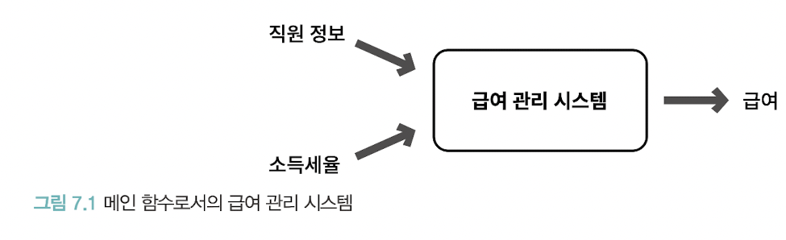

# ch07. 객체 분해

인지과부하(cognitive overload) - 문제 해결에 필요한 단기 기억의 용량을 초과하면 문제 해결 능력이 급격히 떨어지는 현상

방지하려면 불필요한 정보를 제거하고 문제 해결에 필요한 핵심만 남긴다. - 추상화

추상화 - 한 번에 다뤄야 하는 문제의 크기를 줄이는 것

분해(decomposition) - 큰 문제를 해결 가능한 작은 단위로 나누는 것

> 재밌는 예시 - 임의의 11자리 정수 8개를 한꺼번에 기억하기는 어렵지만, 8명의 전화번호 11자리를 기억하는건 비교적 쉬울 것이다.

추상화를 더 큰 규모의 추상화로 압축시키면 단기기억의 한계를 초과할 수 있음 

## v01. 프로시저 추상화와 데이터 추상화

어셈블리어도 로우 레벨 명령어에서 인간 눈높이에 맞는 추상화 제공 시도의 결과

추상화의 발전 -> 프로그래밍 패러다임의 탄생

두 가지 매커니즘
- 프로시저 추상화(Procedural Abstraction)
  - 기능 분해(Functional Decomposition) ~= 알고리즘 분해(Algorithmic Decomposition)
- 데이터 추상화(Data Abstraction)
  - 타입 추상화(Type Abstraction): 추상 데이터 타입(Abstract Data Type)
  - 프로시저 추상화(Procedural Abstraction) - 데이터를 중심으로: 객체 지향(Object-Oriented)

우리가 협력하는 공통체를 구성하도록 객체를 나누는 과정 -> 분해

프로그래밍 언어의 관점에서 객체지향: 데이터를 중심으로 데이터 추상화와 프로시저 추상화를 통합한 객체를 이용해 시스템을 분해하는 방법

이걸 구현하기 위한 도구가 클래스(데이터 추상화 + 프로시저 추상화) -> 객체지향에서는 클래스를 이용해 시스템 분해

## v02. 프로시저 추상화와 기능 분해

### 메인 함수로서의 시스템

기능 분해(알고리즘 분해) - 추상화의 단위가 프로시저

프로시저: 반복적으로 실행되거나 거의 유사하게 실행되는 작업들을 하나의 장소에 모아놓고 재사용 혹은 중복 방지하는 추상화 방법
- 내부를 몰라도 인터페이스만 알면 실행 가능하니 추상화라고 할 수 있음

전통적인 기능 분해 방법은 하향식(Top-Down) 접근법 - 최상위(topmost) 기능을 정의하고 하위 기능으로 분해하는 것

### 급여 관리 시스템

회사는 연초에 기본급에 대해 직원가 협의하고 12개월동안 지급. 급여 지급 시 세율에 따라 세금공제 후 지급

`급여 = 기본급 - (기본급 * 소득세율)`

기능 분해 방법으로 하면 최상위에 있는 메인 프로시저 먼저 -> 직원의 급여를 계산한다.

이걸 분해해보면?

- 직원의 급여를 계산한다.
  - 사용자로부터 소득세율을 입력받는다.
  - 직원의 급여를 계산한다.
  - 양식에 맞게 결과를 출력한다.

정제 가능한 문장이 존재한다면 구현 가능한 수준에서 저수준의 문장이 될 떄 까지 분해

- 직원의 급여를 계산한다.
    - 사용자로부터 소득세율을 입력받는다.
      - "세율을 입력하세요: "라는 문장을 화면에 출력
      - 키보드를 이용해 세율을 입력 받는다
    - 직원의 급여를 계산한다.
      - 전역 변수에 저장된 직원의 기본급 정보를 얻는다
      - 급여를 계산한다
    - 양식에 맞게 결과를 출력한다.
      - "이름: {직원명}, 급여: {계산된 금액}" 형식에 따라 출력 만자열을 생성

기능을 중심으로 필요한 데이터 결정 - 필요한 기능 먼저 생각하고 그 과정에서 필요한 데이터 종류와 저장방식 식별

문제점을 알아보자